# Getting Started

Please find here the slides that were presented as an introduction to the hands-on workshop AD165 at SAP TechEd 2025.

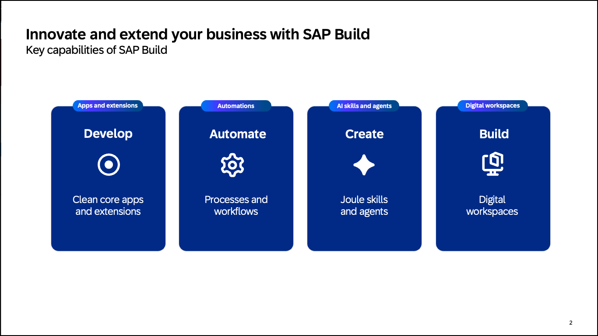

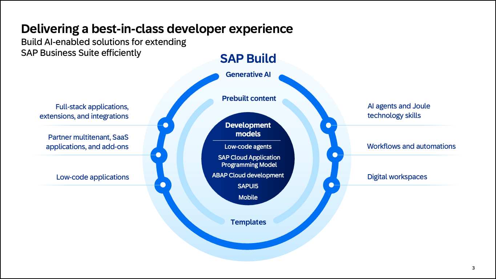

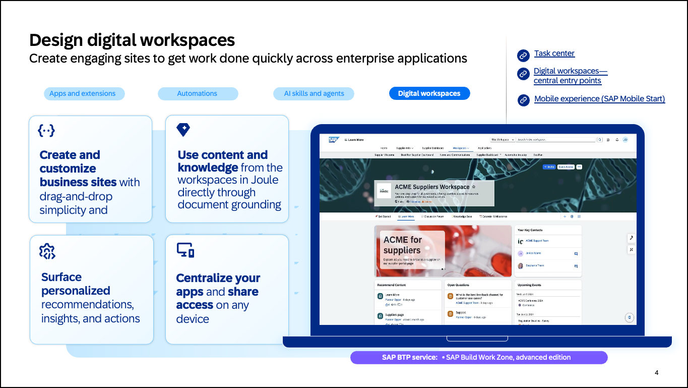

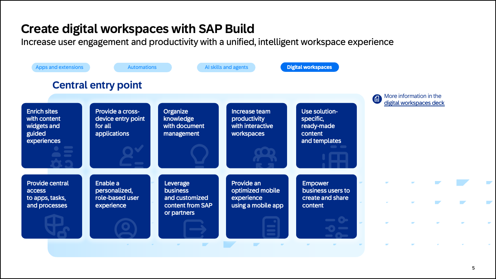

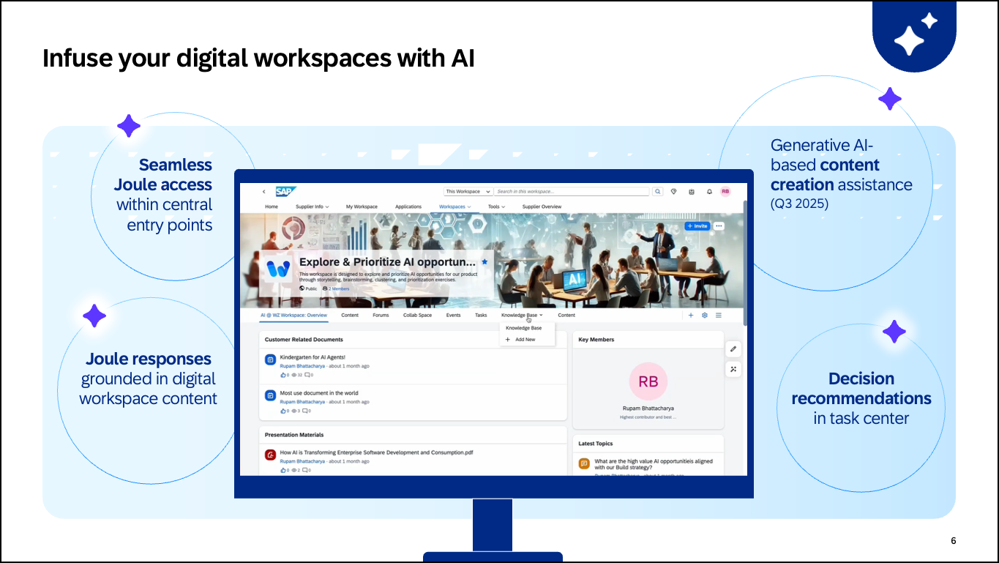

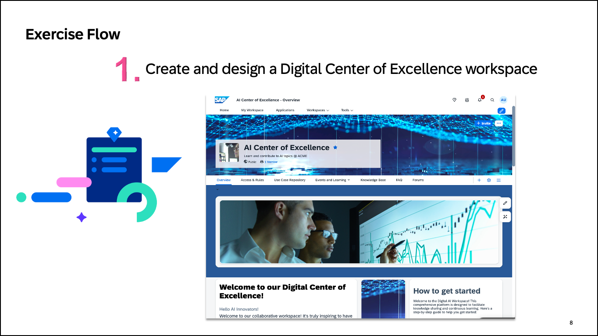

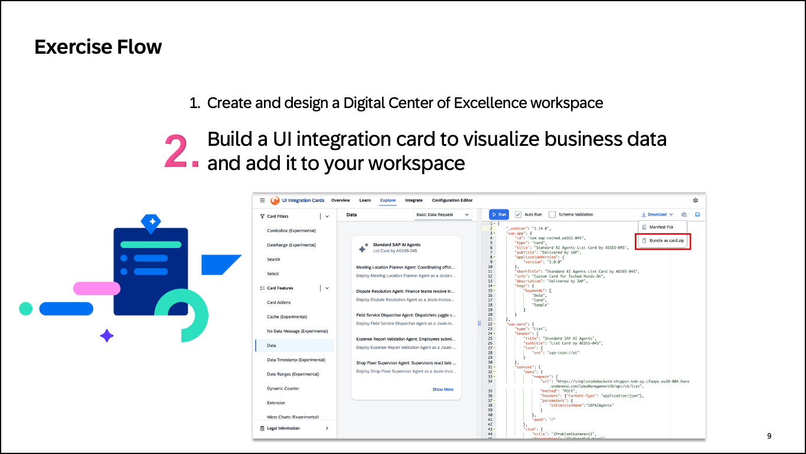

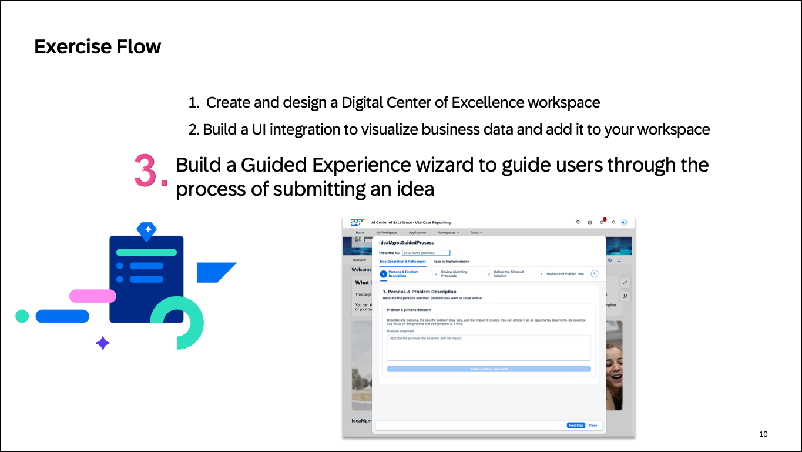

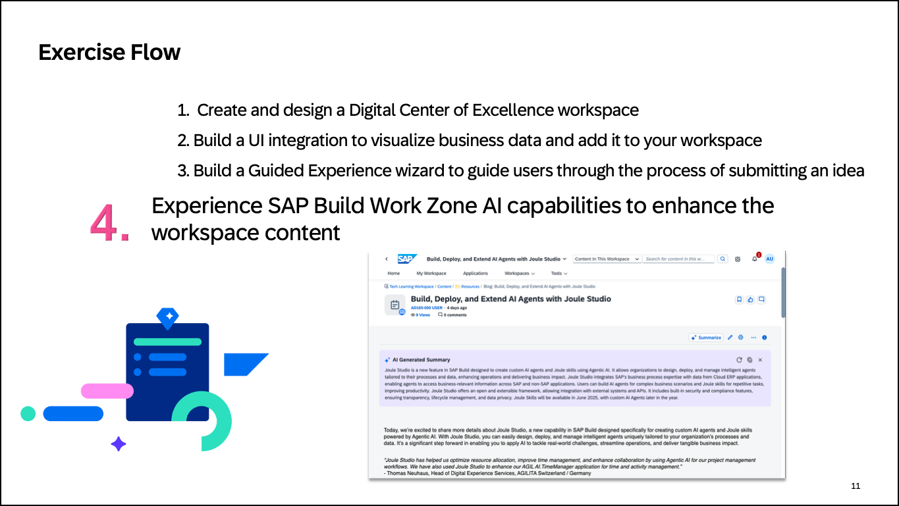

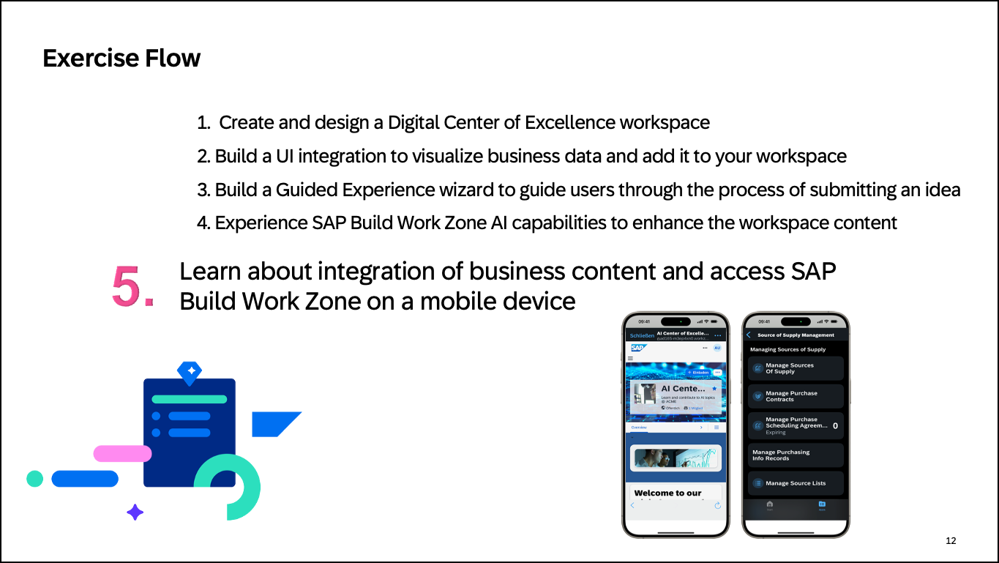

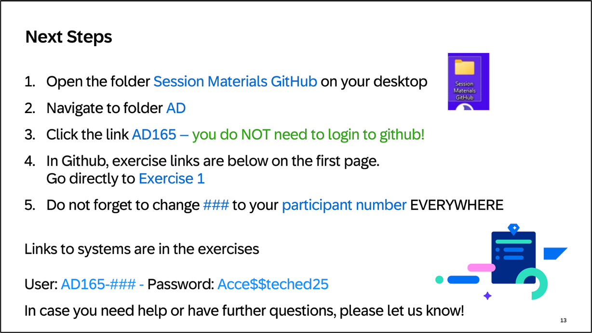

## Summary

Now that you have understood 
- how SAP Build helps customers extend SAP solutions by creating custom apps and extending standard apps, automating processes, and building business sites,
- how to increase user engagement and efficiency with engaging AI-infused business sites, and
- what you can learn in the five exercises of this hands-on workshop, 

continue to - [Exercise 1 - Build your Center of Excellence workspace](../ex1/README.md)
