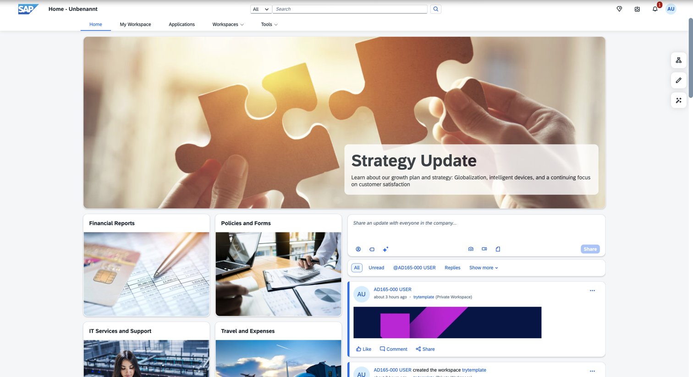
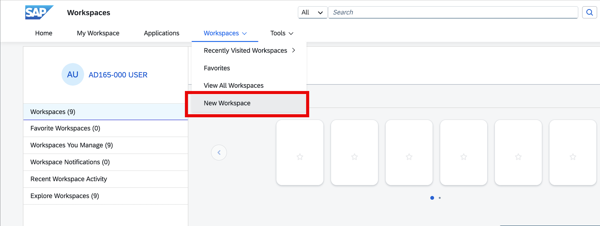
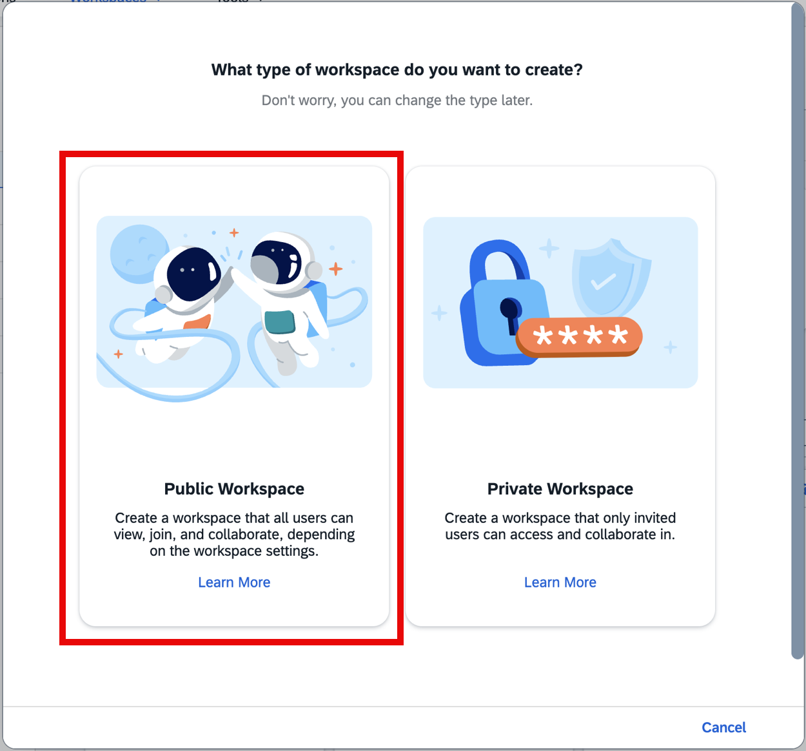
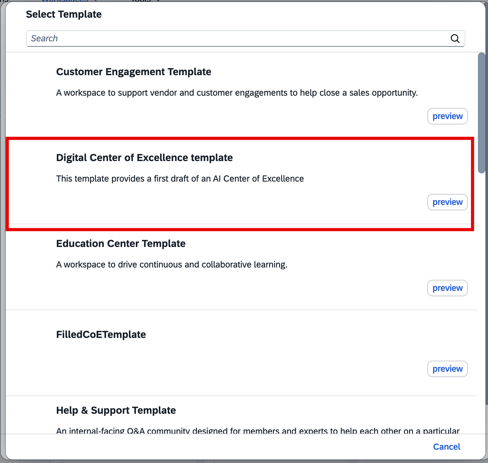

# Exercise 1 - Build your Center of Excellence workspace

In this exercise, you will first access SAP Build Work Zone. 

> [!NOTE]
> SAP Build Work Zone, advanced edition lets you build digital workspace solutions to increase user productivity and engagement. It centralizes access to relevant business applications, processes, information, and communication in a unified entry point that your users can access from any device.


## <a id="access-wz"></a> Exercise 1.1 Get to know SAP Build Work Zone 

1. Open <a href="https://ad165-m3ep4xn0.workzone.cfapps.eu10.hana.ondemand.com/site#workzone-home&/home" target="_blank">SAP Build Work Zone</a> and login with the user that is available on your desk and the password provided by your instructors.


<p align="center"></p>

<!--<br> -->

Note the navigation menu on top of the screen. It contains some default entries of SAP Build Work Zone. You are now on the **Home** page which is the landing page when you first open the site and usually contains information that is relevant to all or most users in your organization.

2. Click **My Workspace** in the menu. This is a personal workspace that can be used as a favorite page for frequently used content and applications.

3. Navigate to the **Applications** tab provides access to all business apps that the logged on user has permissions for and that are configured for display. It can be hidden, if the administrators decide to rather build individual workpages to combine tiles, cards, and other types of widgets than having this central page for accessing applications.

4. Click the back icon to come back to the My Workspace. Now navigate to the **Workspaces** tab.

> [!NOTE]
> A workspace is a collaborative environment that is designed to encourage users to share and communicate with each other about a specific subject, project, event, goal, or a team from a specific department. Workspaces are a very important concept in SAP Build Work Zone, as they allow users to engage with each other and contribute to creating the right work environment for themselves and the people they collaborate with.


## <a id="create-public-ws"></a> Exercise 1.2 Create a public workspace from a template

After completing these steps you will have created a Center of Excellence workspace and made some initial settings. This step does not need to be done by an administrator, but according to their preferences, customers can allow every user or only a specific group of key users to create workspaces to share knowledge and collaborate with colleagues.

> [!NOTE]
> Workspaces can be created from template or from scratch. SAP Build Work Zone comes with a number of pre-configured workspace templates for different use cases to give users a jumpstart when they build their own workspaces. The Digital Center of Excellence template is not part of the standard templates that SAP delivers, but it can be downloaded from the [SAP Build Governance Resource Center](https://workzone.one.int.sap/site#workzone-home&/groups/dfHGUSyc55Z70bNJiHhIsR/workpage_tabs/u4QN8ZTukJEYfR1SXxfMPQ). This is a public workspace open to everyone - please refer to this script ??? for getting access.
>
> There are many options when creating a workspace that you should be aware of. First, there are public workspaces where everyone can join, view, and collaborate in compared to private workspaces that are usually hidden and only accessible to users who have been invited to it. When you create a workspace, you automatically become the workspace administrator. However, you can designate other members to be an admin too. As an admin, you can define what members or non members should be allowed to do in your workspace.

1.	In the menu bar, navigate to *Workspaces > New Workspace*.
<p align="center"></p>

2.	Click the left tile to create a public workspace.
<p align="center"></p>

3. Enter name: **AI Center of Excellence** and a description of your choice.

4. Select the Digital Center of Excellence workspace template. 
<p align="center"></p>

5. Remove the checkmark next to *Allow users to join this workspace* and click **Next**. You could also skip the more advanced settings of the next pages at this time by clicking *Finish* right away, but let us have a short look at the options.
<br>

6. You can leave the *Member Participation* settings as is. Simply click **Next**.
<br>   

7. On the *Non-Member Participation* page, set *Collaboration Level* to **None: All collaboration tools and member details are hidden** and click **Finish**.
<br>

The workspace has been created and you automatically navigate to it. You can now start editing it, but before you do this, you should get familiar with the content it already contains.

As you can see in the workspace menu, there are already a couple of pages available in the workspace. Explore the different pages that were created from the template, e.g. the Overview page, the Forum, the Knowledge Base and other pages. Before publishing your workspace, you will add some more content to these pages or adapt the existing content to the specific use case of a Digital Center of Excellence for AI. 


## <a id="enhance-home"></a> Exercise 1.3 Enhance the header and the start page of the workspace with pre-configured widgets and images

After completing these steps you will have designed a beautiful entry page for your AI Center of Excellence workspace. 

1. Right-click the link [exercises/ex1/samples](https://github.com/SAP-samples/teched2025-AD165/tree/main/exercises/ex1/samples) and open the folder in a new browser tab.
2. Click the content.zip file and use the download button to download the zip file to your local computer.
3. Extract the zip file into a folder of your choice.

#### Exercise 1.3.1   Add a beautiful cover photo
As a first step, you will change the cover photo to something that fits the purpose of the workspace.

1. Click **Edit Cover Photo**, then select **Upload Photo** from the dropdown list.
<br>   

2. Select the AI_Banner.jpg from the folder to which you extracted the image files.
<br>   

3. If you want, you can zoom into the image by using the slider. Select a beautiful display window by dragging the image up and down or left and right. Then click **Save**.
<br>

#### Exercise 1.3.2   Exchange the avatar of the workspace

Now, you will now change the avatar of the workspace, so you can recognize it more easily in the list of workspaces.

1. Hover the little image next to the workspace titel, then click the **Upload workspace avatar** icon that appears.
<br>

2. Upload any image from the images folder.
3. Then deselect **Autofit** to be able to zoom and adjust the display window.
<br>

4. Zoom into the uploaded image and select a nice detail by dragging the image to the right position.
5. Click **Save changes**.
<br>


#### Exercise 1.3.3   Add images to the overview page

1. First, open the workpage editor by clicking the pencil icon on the right of the screen.
<br>

2. Hover the workpage to see the structure according to which the widgets on the page are arranged. You can see that there are several sections in this page. Some of the sections have several (up to 8) columns which themselves can hold several cells.
<br>

4. In the first step, you will add a banner image to the upmost section of the workpage. To do this, you can either drag and drop the banner.png onto the **Drop an image here to upload it** are or click **Or click here to upload an image** and select the banner.png for upload.
<br>

5. Now, change some properties of the section to make it collapsible, so users can save some space on the screen if they want. Move the mouse a bit up till you see the grey frame of the section and click the **Edit section settings** icon [settings icon](/exercises/ex1/images/01_04_0040.png).
<br>

6. Change **Padding Bottom (px)** to 20 and set all switches to *On*, so the section is collapsible and open by default and to extend the background to full width. Add **#21275B** as background color. Then click **Save**.
<br>

7. Now open the cell settings for editing by clicking the **Edit cell settings** icon [settings icon](/exercises/ex1/images/01_04_0040.png).
<br>

8. Turn **Background** on to get a white frame around the image and click **Save**.
<br>

9. Add the image vertical.jpg between the *Welcome* and *How to get started* text widgets in the same way.
<br>


<br><br>
#### Exercise 1.3.4   Remove an unneeded section

You do not need the next section, so you are now going to delete it.
Hover the section till you see the grey section frame and select the **Delete section** icon.
<br>

<br><br>
#### Exercise 1.3.5   Edit the News section

1. In the **News** section, change the title to **Current News**.
<br>

2. In the leftmost text widget, you will now change the text to announce some AI related news. You can use the text generation capability of SAP Build Work Zone to help you generate a text quickly. 
<br>

3. Enter a prompt, e.g. Share some exciting news about AI usage at ACME Corp.

Wait for the text to be generated, then accept or discard (to enter a new prompt) or retry with the same prompt and finally share the news.

<br><br>
#### Exercise 1.3.6   Add a Feed widget to the page

1. Hover the **News** section again until an **Add section** button appears below it. Click the button and select **Freestyle** in the pop-up window.
<br>

2. Click the **Add Content** button in the new section.
<br>
  
3. Select the **Feed** widget.
<br>

4. In the Feed widget properties, select **Workspace Status Only** in the *Filter By* field. Change the *Widget Title* to **Workspace Feed**. Then click **Save**.
<br>

<br><br>
#### Exercise 1.3.7   Exchange the video

You would like to exchange the video for an AI related one. 

1. Hover the video and click the **Edit widget** icon [settings icon](/exercises/ex1/images/01_04_0040.png).

2. Paste the following URL into the input field beneath **Paste URL**: 
```
https://www.youtube.com/embed/A77g1LKqjFg?si=GVW6OK9tdWip_7n6
```

Then click **Save**.
<br>


<br><br>
#### Exercise 1.3.8   Move a widget to a new cell

You would like to move the two elements (text and pink cell) to the right of the video.

1. Hover the section with the video until you see a plus sign to the right of the video. Click the plus icon to add another column to the section.
<br>

2. Drag and drop the content from the left column to the new column. The empty column on the left is automatically deleted.
<br>

<br><br>
#### Exercise 1.3.9 Publish the workpage

1. To make your changes available to users accessing the workspace, click **Publish** on top of the page.
<br>
2. In the publishing pop-up, keep all settings and click **Publish** again. Your changes are now visible to all users of the workspace
<br>


## <a id="add-discussion"></a> Exercise 1.4  Add a discussion topic to the Forum
DO with Text Generation

## Summary

You've now created a first version of a Center of Excellence workspace for AI topics based on a template. Now you can enhance it with a guided experience in Exercise 2.


Continue to - [Exercise 2 - Add a Guided Experience to your workspace](../ex2/README.md)

