# Exercise 1 - Build your Center of Excellence workspace

In this exercise, you will first access SAP Build Work Zone. 

> [!NOTE]
> SAP Build Work Zone, advanced edition lets you build digital workspace solutions to increase user productivity and engagement. It centralizes access to relevant business applications, processes, information, and communication in a unified entry point that your users can access from any device.


## <a id="access-wz"></a> Exercise 1.1 Get to know SAP Build Work Zone 

> [!IMPORTANT]
> Please make sure to open the link below with the browser context menu, right-click and 'Open Link in New Tab' in order to keep this tab (Github exercise) opened.  
1. Open <a href="https://ad165-m3ep4xn0.workzone.cfapps.eu10.hana.ondemand.com/site#workzone-home&/home" target="_blank">SAP Build Work Zone</a> and login with the user that is available on your desk and the password provided by your instructors.


<p align="center"></p>

<!--<br> -->

Note the navigation menu on top of the screen. It contains some default entries of SAP Build Work Zone. You are now on the **Home** page which is the landing page when you first open the site and usually contains information that is relevant to all or most users in your organization.

2. Click **My Workspace** in the menu. This is a personal workspace that can be used as a favorite page for frequently used content and applications.

3. Navigate to the **Applications** tab provides access to all business apps that the logged on user has permissions for and that are configured for display. It can be hidden, if the administrators decide to rather build individual workpages to combine tiles, cards, and other types of widgets than having this central page for accessing applications.

4. Click the back icon to come back to the My Workspace. Now navigate to the **Workspaces** tab.

> [!NOTE]
> A workspace is a collaborative environment that is designed to encourage users to share and communicate with each other about a specific subject, project, event, goal, or a team from a specific department. Workspaces are a very important concept in SAP Build Work Zone, as they allow users to engage with each other and contribute to creating the right work environment for themselves and the people they collaborate with.


## <a id="create-public-ws"></a> Exercise 1.2 Create a public workspace from a template

After completing these steps you will have created a Center of Excellence workspace and made some initial settings. This step does not need to be done by an administrator, but according to their preferences, customers can allow every user or only a specific group of key users to create workspaces to share knowledge and collaborate with colleagues.


> [!NOTE]
> Understanding SAP Build Work Zone: Workspaces
>
>**Workspace Creation:**
>
>- Workspaces can be created from scratch or using templates.
>- SAP Build Work Zone provides pre-configured templates for various use cases to help users get started quickly.
>- The Digital Center of Excellence template is not included in the standard SAP templates but can be downloaded from the [SAP Build Governance >Resource Center](https://workzone.one.int.sap/site#workzone-home&/groups/dfHGUSyc55Z70bNJiHhIsR/workpage_tabs/u4QN8ZTukJEYfR1SXxfMPQ). This is >a public workspace open to everyone. Please refer to this script??? for access details.
>
>**Workspace Types:**
>
>- **Public Workspaces**: Open to everyone for viewing, joining, and collaborating.
>- **Private Workspaces**: Hidden and accessible only to invited users.
>
>**Workspace Administration:**
>
>- The creator of a workspace automatically becomes its administrator.
>- Additional members can be designated as admins.
>- Admin privileges include defining permissions for members and non-members, such as what actions they can perform within the workspace.

STEPS: 

1.	In the menu bar, navigate to *Workspaces > New Workspace*.
<p align="center"></p>

2.	Click the left tile to create a public workspace.
<p align="center"></p>

> [!IMPORTANT]
> Please make sure to replace ### with your participant number. For example participant number 1 results in 001

3. On the first screen, make the following settings:
   - Enter name: **AI Center of Excellence ###** and a description of your choice.
   - Select the **Digital Center of Excellence workspace template**. You could also preview the template to see what it contains.
   - **Keep the checkmarks** to make the workspace freely accessible to all employees in the demo company.
   - Click **Next**.

<p align="center">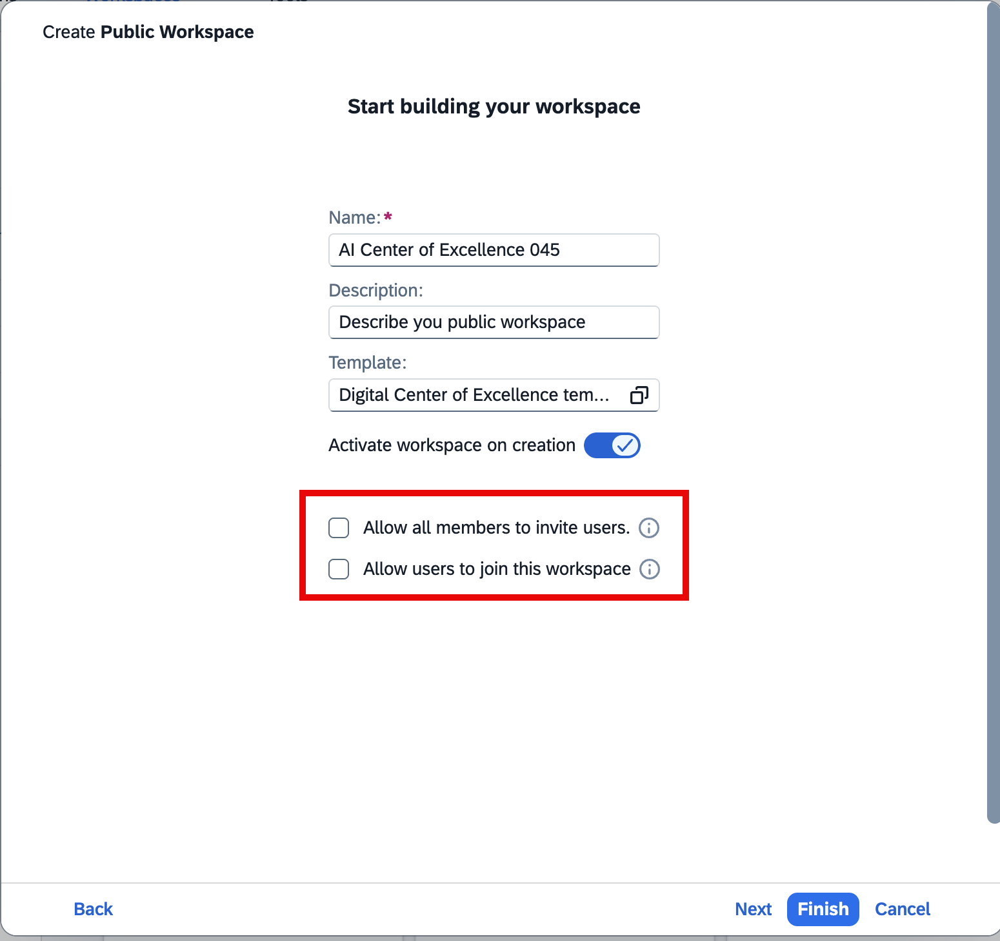</p>

4. You can leave the *Member Participation* settings as **Limited**, so members will be able to collaborate in the workspace, but not to edit or delete the content that you will provide. Simply click **Next**.
<p align="center">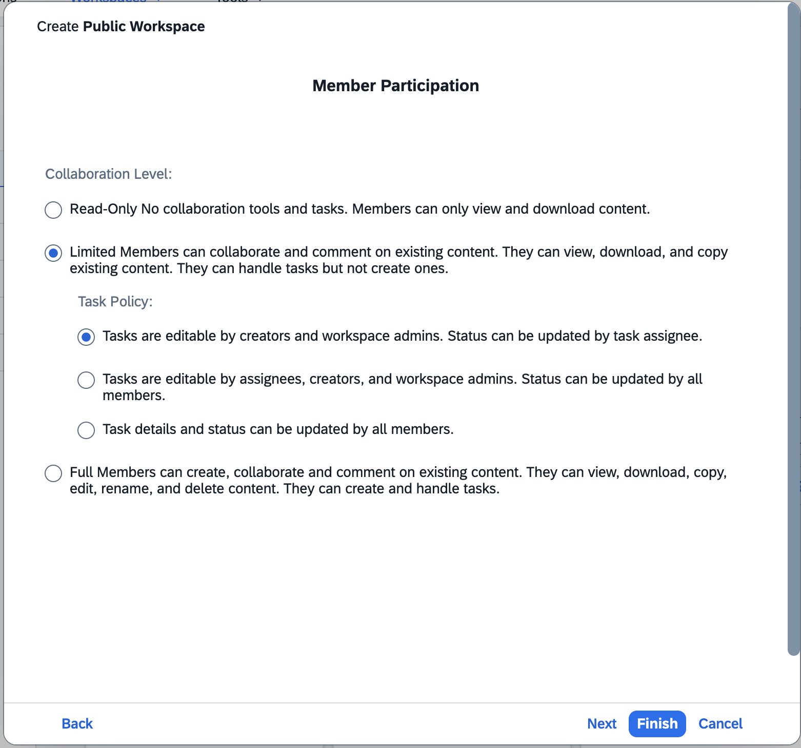</p>

5. On the *Non-Member Participation* page, keep *Collaboration Level* to **Same as Members: Limited** to allow users to collaborate even without joining the workspace. You could also limit the access to certain user lists or roles, but you want to make this workspace available to everyone, so just click **Finish**.

The workspace is created and you automatically navigate to it. It can take some minutes for the workspace to be fully set up, so please wait before continuing until your workspace looks like the image with the pink checkmark a bit further below. 

> [!IMPORTANT]
> The workspace will first show up empty and only after a while, you will see it with the template content applied. So, as long as you still see this screen, the workspace is not yet fully loaded. 
> <p align="center">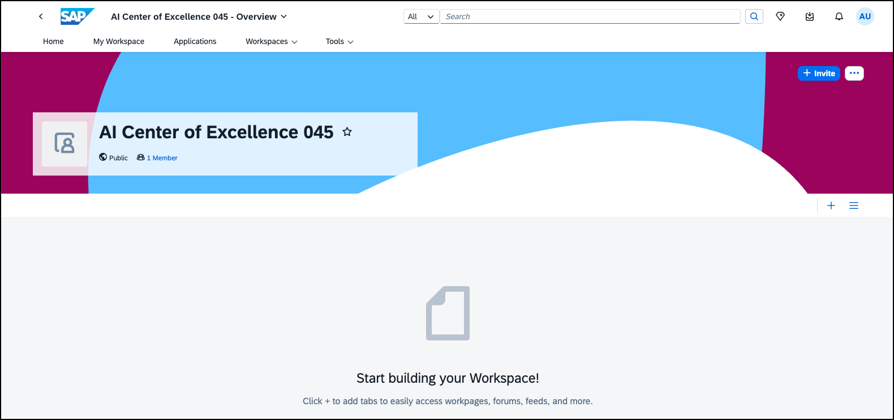</p>

In the meantime, you can download some images that you can use when editing your workspace.

6. Right-click the link [exercises/ex1/samples](https://github.com/SAP-samples/teched2025-AD165/tree/main/exercises/ex1/samples) and open the folder in a new browser tab.
7. Click the Content.zip file and use the download button to download the zip file to your local computer.
8. Extract the zip file into a folder of your choice.

<p align="center">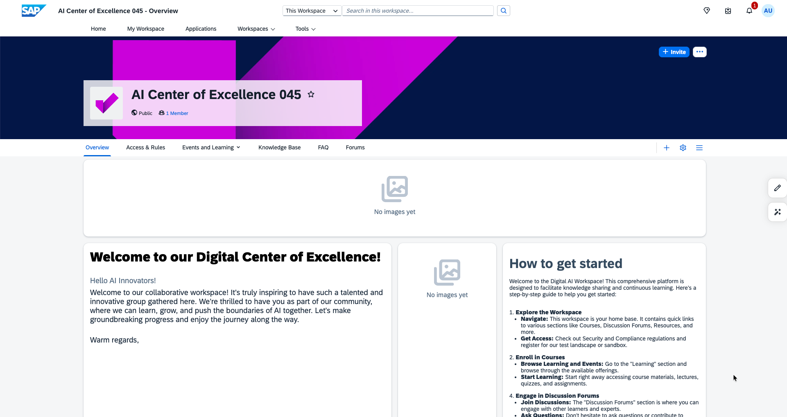</p>

If you do not see the fully loaded workspace, try refreshing the brower. If that does not help, you might also do [Exercise 2.1 What is the Card Explorer](../ex2#what-is-the-card-explorer) and [Exercise 2.2 Select an advanced UI card and adapt it to your needs](../ex2#exercise-22-select-an-advanced-ui-card-and-adapt-it-to-your-needs) before coming back to this exercise.

Once your workspace is fully loaded, you can get started by making yourself familiar with the content it already contains.

As you can see in the workspace menu, there are already a couple of pages available in the workspace. Explore the different pages that were created from the template, e.g. the Overview page, the Forum, the Knowledge Base and other pages. Before publishing your workspace, you will add some more content to these pages or adapt the existing content to the specific use case of a Digital Center of Excellence for AI. 


## <a id="enhance-home"></a> Exercise 1.3 Enhance the header and the start page of the workspace with pre-configured widgets and images

After completing these steps you will have designed a beautiful entry page for your AI Center of Excellence workspace. 

### What you’ll do (at a glance)

1. **Exchange the cover photo** in the Workspace header.
2. **Replace the avatar** of the workspace, so users can find it more easily.
3. **Change the structure of the Overview page**: adding columns, moving widgets
4. **Edit a news widget**: add the footer with the paginator button to show a popup that lists all SAP AI Agents.
5. **Exchange a video**: change the card id, title, subtitle, etc to make it unique for each participant for conflict-free deployment & unique identification of card at runtime.
6. **Add a widget**: display a workspace feed.
7. **Publish the workspace** so users can find and join it.
---

#### Exercise 1.3.1   Add a beautiful cover photo
As a first step, you will change the cover photo to something that fits the purpose of the workspace.

1. Click **Edit Cover Photo**, then select **Upload Photo** from the dropdown list.
<p align="center"></p>

2. Select the 'AI_Banner.jpg' from the folder to which you extracted the image files. The picture looks different from the screenshot below, as initially its upper part shows up, while in the screenshot a different part was selected for display.

3. If you want, you can zoom into the image by using the slider. Select a beautiful display window by dragging the image up / down or left / right. Then click **Save**.
<p align="center">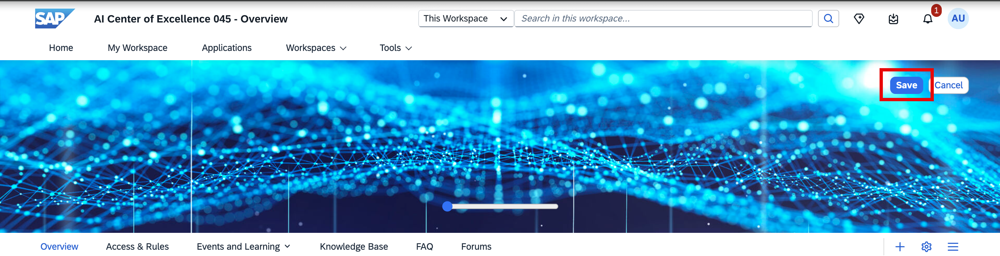</p>

---

#### Exercise 1.3.2   Exchange the avatar of the workspace

Now, you will change the avatar of the workspace, so you can recognize it more easily in the list of workspaces.

1. Hover the little image next to the workspace titel, then click the **Upload workspace avatar** icon that appears.
<p align="center">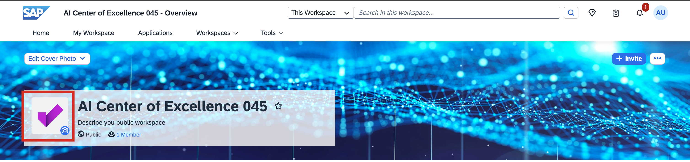</p>

2. Upload any image from the images folder.
   
4. Then deselect **Autofit** to be able to zoom and adjust the display window.

5. Zoom into the uploaded image and select a nice detail by dragging the image to the right position.
   
7. Click **Save changes**.
<p align="center">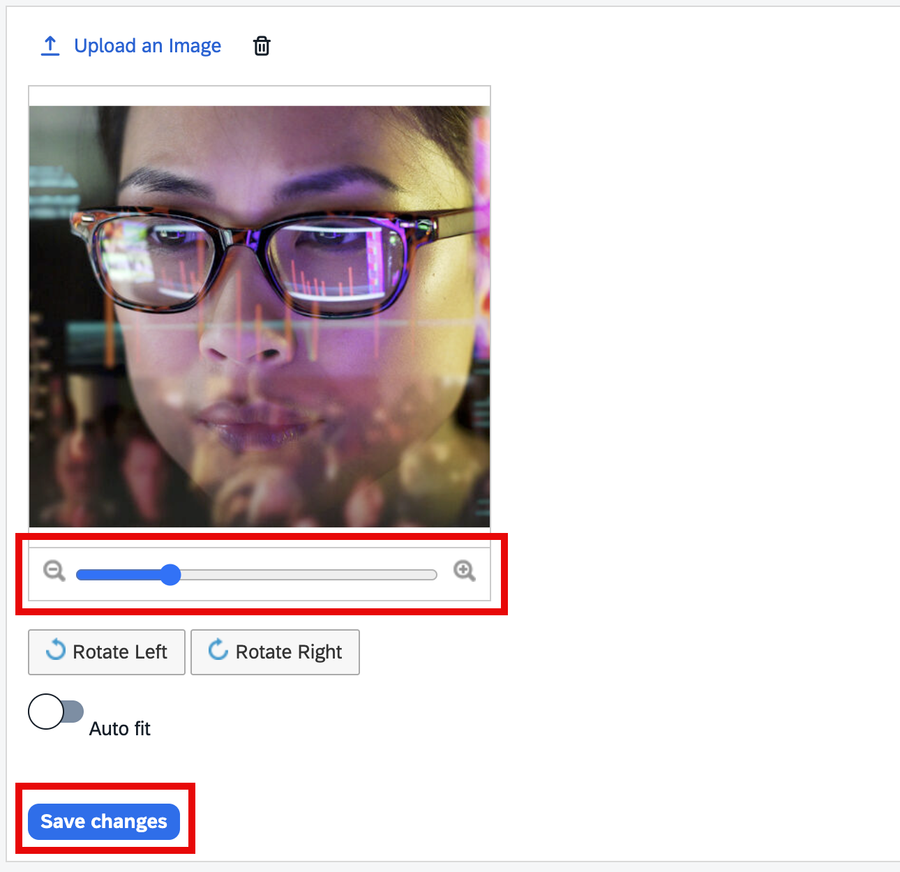</p>

---

#### Exercise 1.3.3   Add images to the overview page

Workpages can be structured using various layout elements that offer a flexible way to organize and display information. The layout contains the following elements:
- **Sections are the top-level containers**. When you add a section to a workpage, you'll get a popup with the option to select the layout you prefer: Freestyle or Wizard. The Freestyle layout can be used to add various types of content such as widgets, apps,  tiles, cards, and more. The second option is the Wizard layout that you use if you want to add a guided experience.
- **Columns devide a section horizontally**. You can have up to 8 columns in one section.
- **Cells** are the smallest units within a column, where you can add tiles, cards, and widgets to your workpage.


1. Access the workpage editor from the right side of your workpage by clicking the pen icon.
<p align="center">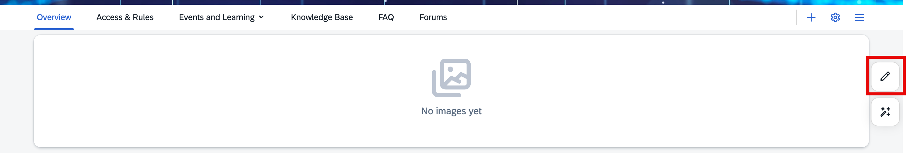</p>

2. Hover the workpage to see the structure according to which the widgets on the page are arranged. You can see that there are several sections in this page, some of them have several columns. The borders of the sections, columns, and cells are displayed when you hover them.
   
<p align="center">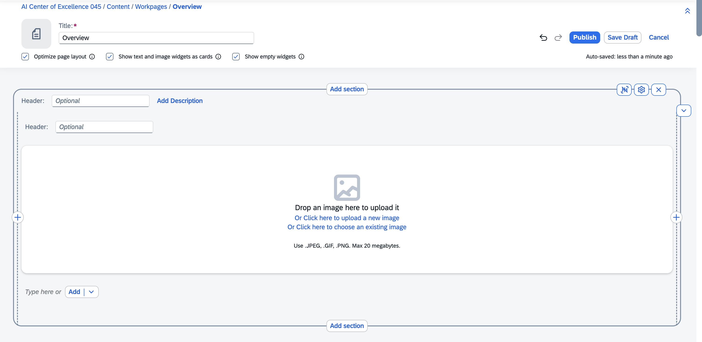</p>

3. In the first step, you will add a banner image to the upmost section of the workpage. This section already contains an image widget, so you can either drag and drop the 'Overview_banner.png' onto the **Drop an image here to upload it** or click **Or click here to upload a new image** and select the 'Overview_banner.png' for upload.

4. Now, change some properties of the section to make it collapsible, so users can save some space on the screen if they want. Move the mouse a bit up till you see the grey frame of the section and click the **Edit section settings** icon [settings icon](/exercises/ex1/images/Settings_icon.png).
<p align="center">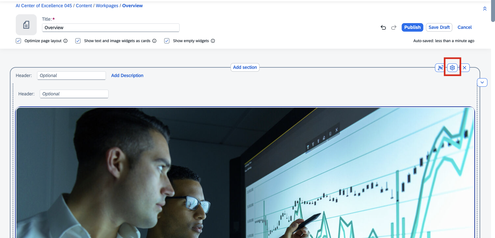</p>

5. Change **Padding Bottom (px)** to 20 and set all switches to *On*, so the section is collapsible and open by default and to extend the background to full width. Add **#21275B** as background color. Then click **Save**.
<p align="center">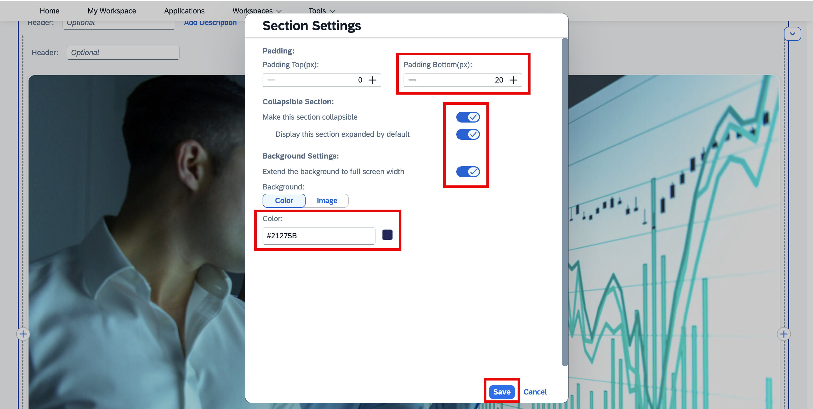</p>

6. Now open the cell settings for editing by clicking the **Edit cell settings** icon [settings icon](/exercises/ex1/images/Settings_icon.png).
<p align="center">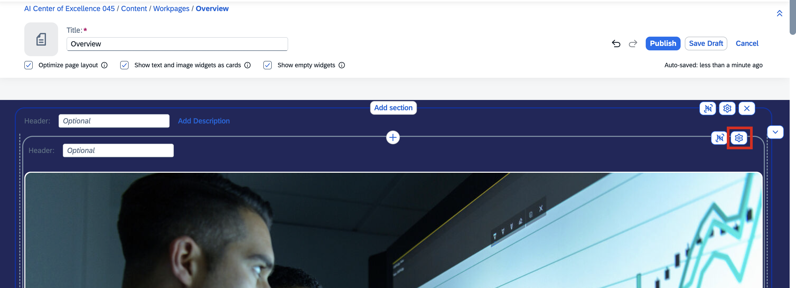</p>

7. Turn **Background** on to get a white frame around the image and click **Save**.
<p align="center">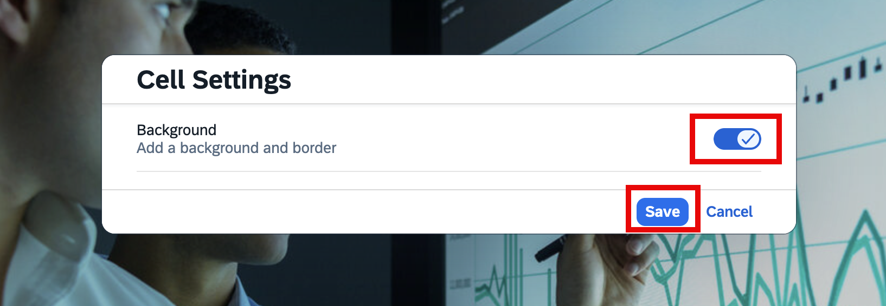</p>

8. Add the image 'Vertical_S2.jpg' between the *Welcome* and *How to get started* text widgets in the same way.
<p align="center">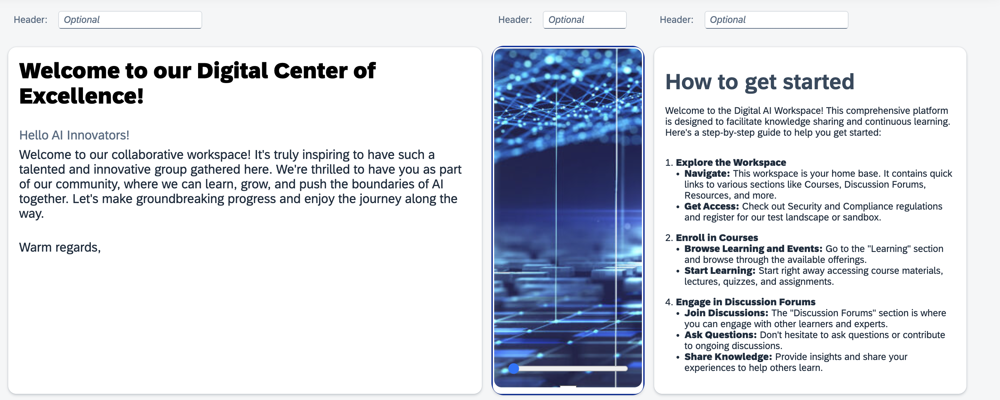</p>


---

#### Exercise 1.3.4   Remove an unneeded section

You do not need the next section, so you are now going to delete it.
Hover the section till you see the grey section frame and select the **Delete section** icon.
<p align="center">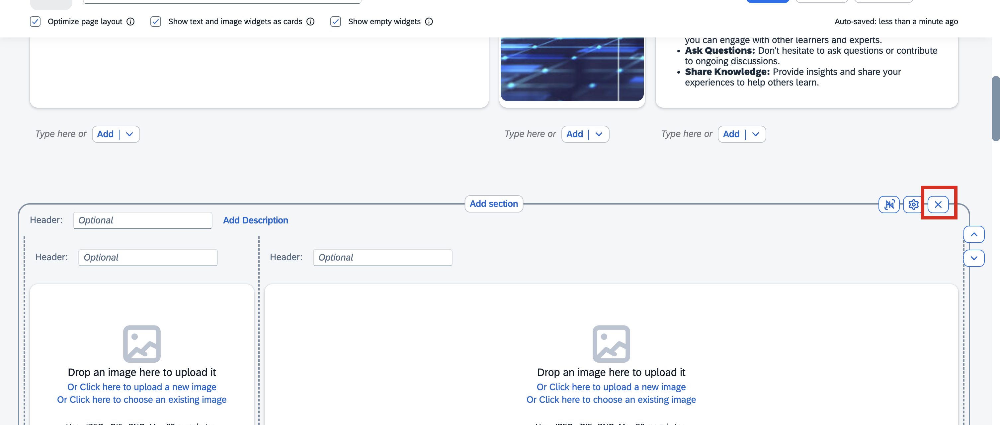</p>

---

#### Exercise 1.3.5   Edit the News section

This news section was built with text widgets. You might also use the Rotating Banner widget for this purpose which you will see later in exercise 3.

1. In the **News** section, change the title to **Current News**.
<p align="center">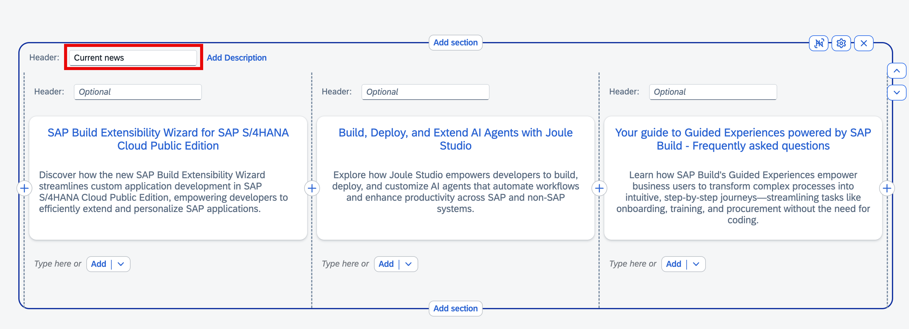</p>

2. In the leftmost text widget, you will now change the text to announce a new submission tool.

Click into the text field and replace the headline with **Submit your AI Ideas!** and the paragraph with this text

````
We're excited to introduce a new wizard that lets you share your AI ideas to boost work efficiency. Your insights are key to refining our processes and keeping us at the forefront of the industry. You can find this wizard on the Use Case Repository page in this workspace. We truly appreciate your contributions!
````
Make sure to keep the same font sizes as in the other text widgets: 14pt for the headline and 12pt for the paragraph.
<p align="center">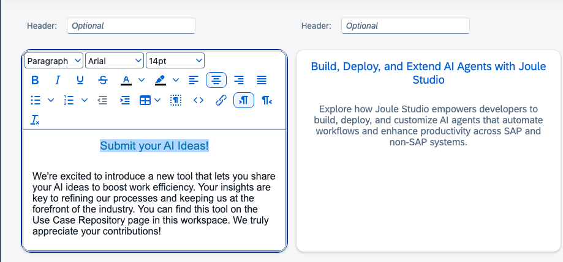</p>

Your changes are saved as soon as you move the mouse away from the text widget.


---

#### Exercise 1.3.6   Add a Feed widget to the page

You will now add a new section that shall contain a full width feed widget. There are two options when creating sections in Work Zone: **Freestyle sections and wizard sections to host Guided Experiences**. Freestyle sections are automatically created with one column and one cell, so you can immediately add content to it or extend the structure by adding further columns and cells. 

1. Hover the **News** section again until an **Add section** button appears below it. Click the button and select **Freestyle** in the pop-up window.
<p align="center">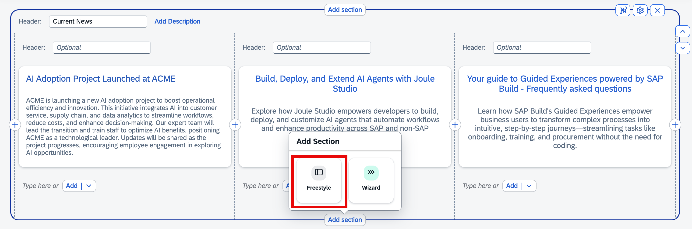</p>

There is now a new option besides adding a tile, card, or other widget from the widget gallery to a cell: You can also use AI to generate a text to put into the cell. You will do this later in exercise 4. Now you will put an SAP delivered Feed widget.

2. Click the left side of the **Add** button in the new section or click the dropdown icon and select **Add Content**. 
<p align="center">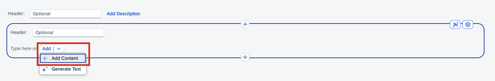</p>
  
3. Select the **Feed** widget.
<p align="center">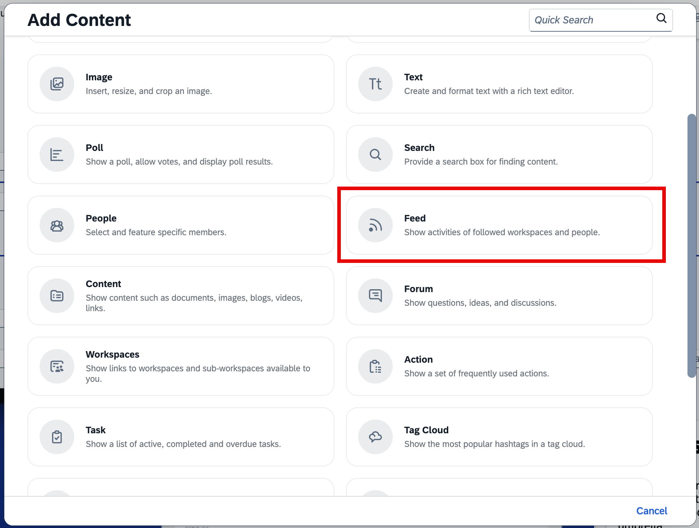</p>

4. In the Feed widget properties, select **Workspace Status Only** in the *Filter By* field. Change the *Widget Title* to **Workspace Feed**. Then click **Save**.
<p align="center">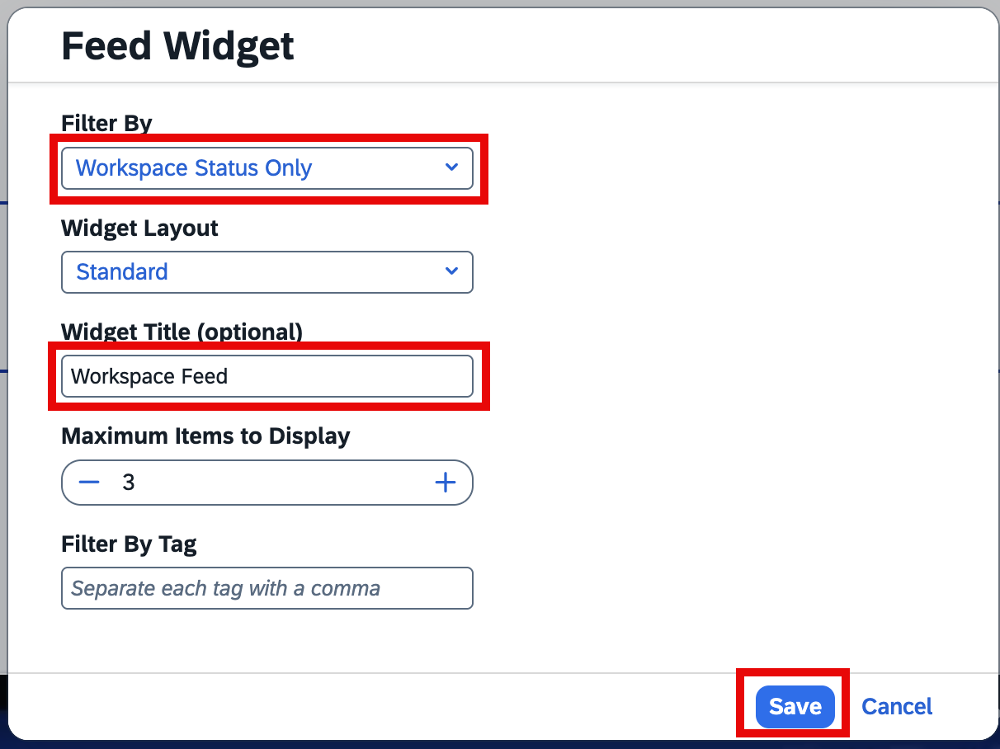</p>

<p align="center">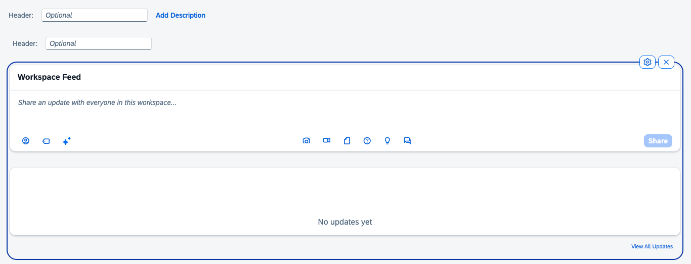</p>

---

#### Exercise 1.3.7   Exchange the video

You would like to exchange the video for an AI related one. 

1. Hover the video and click the **Edit widget** icon [settings icon](/exercises/ex1/images/Setting_icon.png).
<p align="center">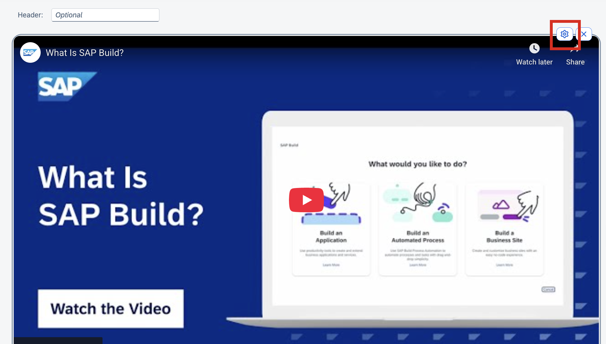</p>

2. Paste the following URL into the input field beneath **Paste URL**: 
```
https://www.youtube.com/embed/A77g1LKqjFg?si=GVW6OK9tdWip_7n6
```

Then click **Save**.
<p align="center">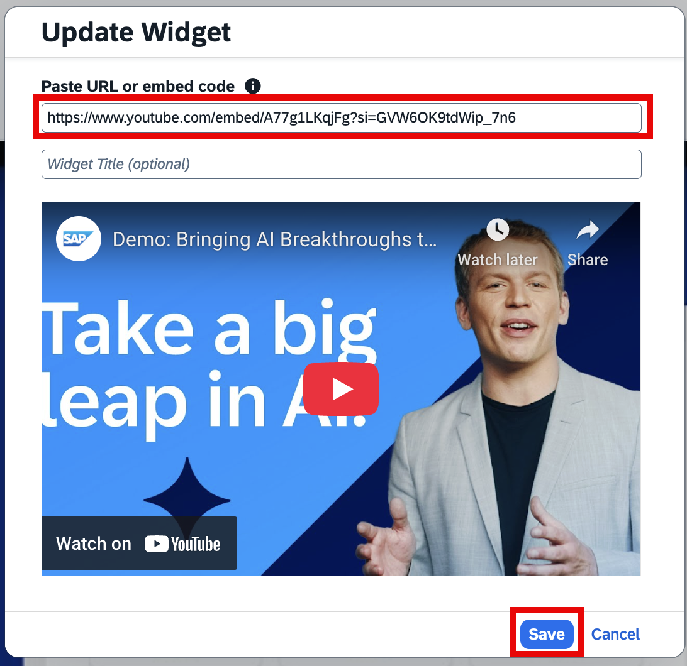</p>

---

#### Exercise 1.3.8   Move a widget to a new cell

You would like to move the video to the right of the two elements (text and pink button).

1. Hover the section with the two elements until you see the section frame including a plus sign to the right of the section. Click the plus icon to add another column to the section.
<p align="center">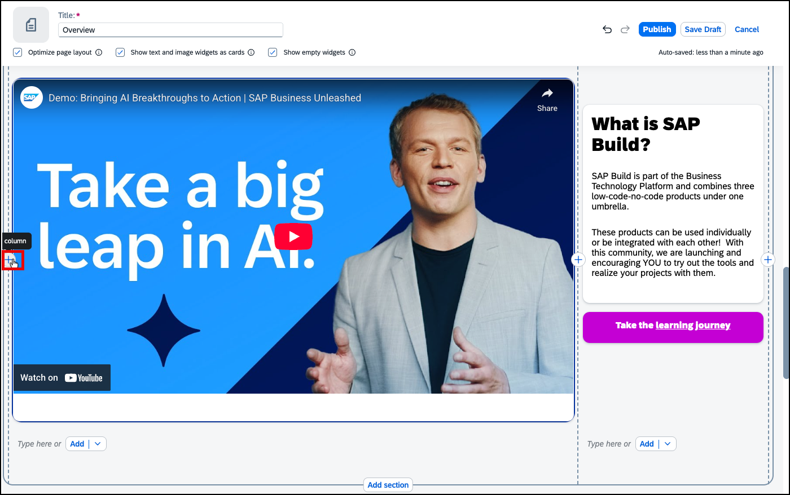</p>

2. Drag and drop the video widget from the left column to the upper part of the new column. You can drop it as soon as a blue line appears. 
<p align="center"></p>

3. Delete the empty cell on the right by clicking the **Delete cell** icon.
<p align="center">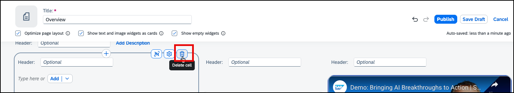</p>

4. Now adjust the width of the columns: To do this, you need to move the mouse over the separation between the columns until the section is selected. This is the case, when the *Add Section* button appears on top of the section. The cursor then changes its look and can be used to drag the separation between the columns to the left or right. The size of the widgets in the sections adapts automatically to fill the available space in an optimal way.
<p align="center"></p>

---

#### Exercise 1.3.9 Publish the workpage

1. To make your changes available to users accessing the workspace, click **Publish** on top of the page.
<p align="center">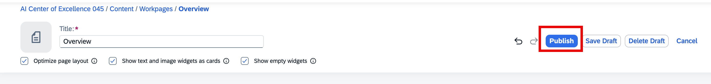</p>

2. In the publishing pop-up, keep all settings and click **Publish** again. Your changes are now visible to all users of the workspace
<p align="center">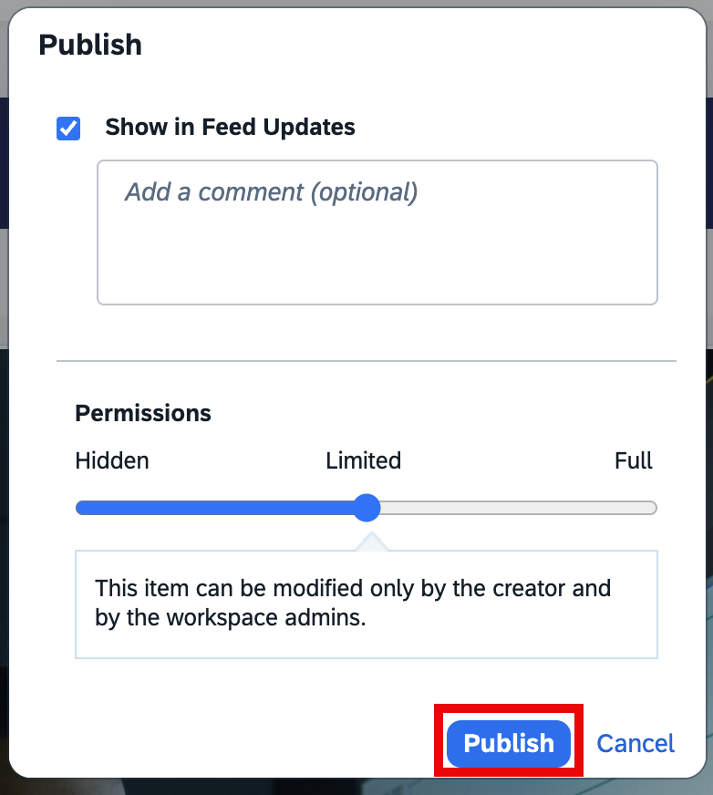</p>


## Summary

You've now created a first version of a Center of Excellence workspace for AI topics based on a template. Now you can enhance it with a **UI Integration Card in Exercise 2**.


Continue to - [Exercise 2 - Add a UI integration card to your workspace](../ex2/README.md)

