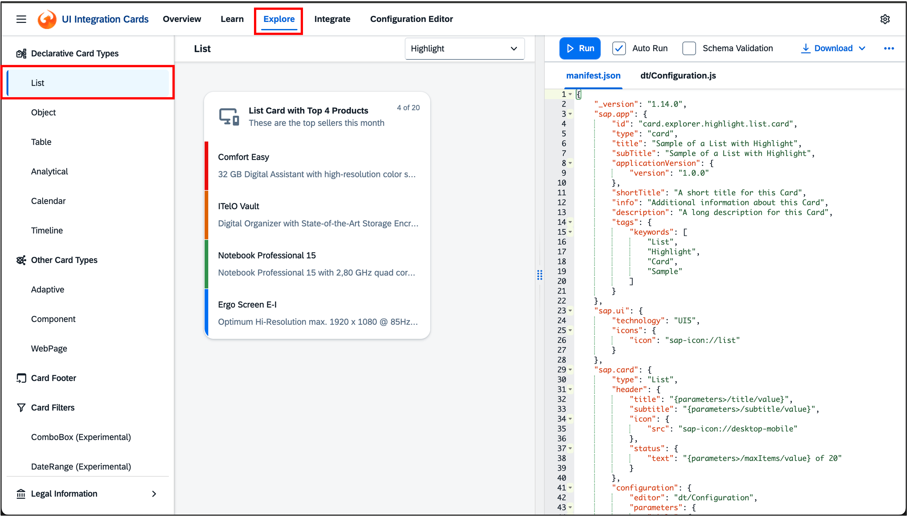

# Exercise 2 - Add a UI integration card to your workspace

In this exercise, you will learn what are UI integration cards, you will modify a sample card, connect it with real data, download the card bundle, upload it to Work Zone, enable the card access via administration activities and finally add it to a workspage in your workspace.

> [!NOTE]
> Integration cards present a  means to expose application content to the end user in a unified way. A card is a design pattern that displays the most concise pieces of information in a limited-space container. Similar to a tile, it helps users structure their work in an intuitive and dynamic way while presenting more data at first sight than a tile usually does. 💡 Think of UI integration cards are mini-apps that show key info directly on Work Zone pages — you’ll create one and add it to your workspace so that it's visible to all it's members.

## Exercise 2.1 Explore the UI Cards in Card Explorer

### What you’ll achieve
After completing this exercise, you’ll be familiar with the **UI Card Explorer** and understand the basic anatomy of a simple **List** card (what each manifest section does).

---

### What is the Card Explorer?
The Card Explorer is an interactive playground for **UI Integration Cards**. It lets you:
- Preview different **card types** and **features**.
- Inspect and edit the card’s **`manifest.json`** side-by-side.
- See how **data**, **actions**, **configuration**, and **filters** change a card.
- Copy snippets or **download** a working sample for your own use.

> **Tip:** Everything you see in the preview is driven by the `manifest.json`. You’ll learn which parts of the manifest control which parts of the UI. 

  
_The “Explore” tab showing: left navigation (Card Types & Card Features), center preview, right manifest panel._

> [!NOTE]
> All steps below in this exercise 2.1 refer to this screenshot

---

### Steps

1. Right click on the link below and **Open the link in a new tab**. This will open the [Card Explorer](https://sapui5.hana.ondemand.com/test-resources/sap/ui/integration/demokit/cardExplorer/webapp/index.html) with **_Explore_.** tab selected.

	Go to:  [https://sapui5.hana.ondemand.com/test-resources/sap/ui/integration/demokit/cardExplorer/webapp/index.html#/explore/list](https://sapui5.hana.ondemand.com/test-resources/sap/ui/integration/demokit/cardExplorer/webapp/index.html#/explore/list)
   
   The page has three main areas:  
   - **Left navigation:** _Card Types_ (e.g., **List**, Object, Table, Analytical, Calendar, Timeline, WebPage, Component, Adaptive) and _Card Features_ (Data, Actions, Configuration, Filters, etc.).  
   - **Center:** a live **Preview** of the selected card.  
   - **Right:** the card’s **`manifest.json`** editor.

2. **Skim the Card Types (what you can build).**  
   - **List** – list of items (title/description/info), optional actions & pagination.  
   - **Object** – attribute/value groups.  
   - **Table** – tabular data.  
   - **Analytical** – KPIs/charts (often with a Numeric Header).  
   - **Calendar**, **Timeline**, **WebPage**, **Component**, **Adaptive** (MS Adaptive Cards).  
   These map to the `sap.card/type` in the manifest.

3. **Open _Card Types ▸ List_.**  
   Review how the **List** card renders in the preview, then open the **manifest** on the right.

4. **Understand the manifest anatomy (what each part is for).**  
   A card is defined by a **JSON manifest** with a few key namespaces:

   - **`sap.app`** → app/card metadata & identity  
     - `id`: A unique identifier (e.g., `com.example.cards.samplelist`)  
     - `type`: Must be `"card"` for UI Integration Cards  
     - `title`, `shortTitle`, and `applicationVersion.version`

   - **`sap.card`** → the card itself. Common subsections:  
     - **`type`** – one of: List/Table/Object/Analytical/Timeline/WebPage/AdaptiveCard/Calendar/Component/...  
     - **`header`** – title, subtitle, icon, optional status or numeric header.  
     - **`data`** *(optional)* – where the card gets data: a REST `request` (`url`, `method`, `headers`, `parameters`) and a `path` for binding. Usually, accessed via BTP destinations.
     - **`content`** – how to render the UI. For **List**, define the `item` template: `title`, `description`, `info`, and (optionally) `actions` and `maxItems`.  
     - **`footer`** *(optional)* – components like a `paginator`.  
     - **`configuration`** *(optional)* – **parameters**, **destinations**, **filters**, and other host-configurable settings.  
     - **`actions`** *(optional)* – interactive behaviors like `Navigation` or `Submit`. For **List**, row-level interactions usually go under `content.item.actions`.

5. **Peek at _Card Features_ to see “how it’s done.”**  
   - **Configuration**: how to declare `parameters`, `destinations`, `filters`, Markdown support, etc. (manifest → `sap.card/configuration`).  
   - **Data**: how to set up a `request` (URL/method/headers/parameters) and bind to a `path`.  
   - **Filters**: how to define end-user filters under `configuration` and bind them to your data.  
   - **Actions**: how to make headers or list items clickable; the host handles events like `Navigation` or `Submit`.

> **Takeaway:** The Explorer lets you test card **types** and inspect the **manifest** that drives them—especially `sap.card/type`, `header`, `data`, `content`, `footer`, `configuration`, and `actions`. These are the only pieces you need to understand before adapting a List card in the next step.

---

### Minimal “List” card anatomy (reference)
<details>
<summary>sample UI card JSON</summary>

```json
{
  "sap.app": {
    "id": "com.example.cards.samplelist",
    "type": "card",
    "title": "Sample List Card",
    "applicationVersion": { "version": "1.0.0" }
  },
  "sap.card": {
    "type": "List",
    "header": {
      "title": "Orders",
      "subtitle": "Recent",
      "icon": { "src": "sap-icon://product" }
    },
    "data": {
      "request": {
        "url": "https://example.com/api/orders",
        "method": "GET",
        "headers": { "Accept": "application/json" }
      },
      "path": "/items"
    },
    "content": {
      "item": {
        "title": "{OrderName}",
        "description": "{Customer}",
        "info": "{Status}",
        "actions": [
          { "type": "Navigation", "parameters": { "url": "{Link}" } }
        ]
      },
      "maxItems": 5
    },
    "footer": {
      "paginator": { "pageSize": 5 }
    },
    "configuration": {
      "parameters": { "region": { "value": "EMEA" } }
    }
  }
}
```
</details>

---

## Exercise 2.2 Select an advanced UI card and adapt it to your needs

### What you’ll achieve

By the end of this exercise, you will have:
- Modified a **sample List card** in the Card Explorer,
- Switched its data source to show a list of AI Agents published by SAP,
- Seen your changes live in the **card preview** as you make your changes, and
- **Downloaded the card bundle** (`card.zip`) to your computer for use in the next exercises.

### What you’ll do (at a glance)

1. **Start from a sample List card** in the Card Explorer (the one that reads from Northwind OData).
2. **Replace the data source**: point the card’s `sap.card.data.request` to the provided **Node.js backend** (simple REST API) that returns a list of SAP AI Agents.
3. **Bind the list fields**: map the list item properties (e.g., `title`, `description`, `actions`) to properties returned by the API.
4. **show list all button in footer**: add the footer with the paginator button to show a popup that lists all SAP AI Agents.
5. **Update card propoerties**: change the card id, title, subtitle, etc to make it unique for each participant for conflict-free deployment & unique identification of card at runtime.
6. **Download the bundle**: export your customized card as `card.zip` for import into SAP Build Work Zone.

### Steps

1. Esure that you are already in **Explore** tab of [Card Explorer](https://sapui5.hana.ondemand.com/test-resources/sap/ui/integration/demokit/cardExplorer/webapp/index.html#/explore/list). Find and select the **Card Features** > **Data** from the _left navigation panel_ and ensure that the default **Basic Data Request** card is selected in the drop-down as shown in the screenshot below. To adapt the card, you can adjust its *`manifest.json`* file on the right.
   
<br> 
<br>

1. In this _manifest.json_, line 32 to 41 - `data` node within `content` describe how to fetch the data. By default, the sample card fetches list data from demo Northwind service. 
	Change this data josn block to the following (replace line 32 to 41 with the lines below) -

````json
			"data": {
				"request": {
					"url": "https://simplenodebackend-chipper-kob-zy.cfapps.eu10-004.hana.ondemand.com/IdeaManagementDB/api/v1/list",
					"method": "POST",
					"headers": {"Content-Type": "application/json"},
					"parameters": {
						 "collectionName":"SAPAIAgents"
					}
				},
				"path": "/"
			},
````

> [!TIP]
> As soon as you make changes to the manifest, you can see the effect on the card preview. In case you notice error either on the manifest.json or the card preview, cross-check if you have all the pairs of opening and closing braces, no trailing commas or mismatch of quotation marks.

Manifest should now look like this - 
<p align="center">
<image src='/exercises/ex2/images/02_02_0020.png' width='700px'></image>
</p>

At this stage your card looks like this - 
<p align="center">
<image src='/exercises/ex2/images/02_02_0021.png' height='500px'></image>
</p>

> [!NOTE]
> Ofcourse, this is not the end-state - The data is not shown correctly since the UI field mapping is missing the card UI will be fixed in the next step when you will bind the attributes of the fetched data to the UI properties of the list row.

#### Let us understand what changes were made and why

- **url**: We now point the card to fetch the data from pre-deployed **Node.js backend** (simple REST API) that returns a list of published SAP AI Agents. Now the card will do a HTTP request on this url (instead of Northwind service). For product ready cards, you shouldn't use direct backend URL and instead use **BTP destinations** and configure the BTP destination in your BTP sub-account to point to the actual backend service. But, for sake of ease of this hands-on exercise we will directly point to the data service.
- **method**: This tells whether to use GET, POST, PUT, PATCH or DELETE during the HTTP request. Since the **Node.js backend** expects a POST query to list the SAP AI Agents, it is changed to POST in this case.
- **headers**: HTTP headers are key-value pairs sent in HTTP requests that provide metadata about the communication, such as content type, encoding, caching information, and authentication credentials. In this case, the `content-type` is set to `application/json` so that server can recognise the format of additional parameters sent in body.
- **parameters**: parameters in case of _POST_ HTTP call signify that the content would be sent as a payload in the body of the HTTP request. In this case, the backend server expects tthe `collectionName` as `SAPAIAgents` to be sent based on which it would retrieve and respond with a list of SAP AI Agents published in SAP Discovery Center.
- **path**: path tells where to find relevant data in the JSON returned by the server in as a HTTP response. In this case, the server responds with a array of JSON objects right at the root and hence `path` is set to `/`.

---

2. Now let us fix the UI and make it show the correct data by mapping the list item properties to correct data row attributes. This needs to be done in the `items` node (line 43 to 47) of the `content` right below the `data` which you changed previous.
   
   <br> - First, remove the last proprty `"highlight"` as it is not necessary for the list of sap AI Agents to differentiate row with green, orange and red row markers.
   <br> - Change the `title` property into `"{ProblemStatement}",` 
   <br> - Change the `description` property into `"{RefinedSolution}"`

We map the title and description to these attributes becuase the service response returns the json in a format where these attributes are filled for each row of data for the SAP AI Agent details. 

> [!NOTE]
> SAP UI5 binding syntax (curly braces) are applicable in UI integration cards. Later you will use the expression binding as well to understand advanced binding mechanism.

The `item` section starting in line 43 should have the following entry:

<p align="center">
<image src='/exercises/ex2/images/02_02_0022.png' width='500px'></image>
</p>

At this point, the card should look like 

<p align="center">
<image src='/exercises/ex2/images/02_02_0023.png' height='500px'></image>
</p>

---

3. Currently the card can only show a limited set of items (as defind in `MaxItems` in line 47). Let us add a footer with pagination option so that users will be able to see all existing SAP AI Agents as a popup dialog with vertical scroll.
   <br> - After the `Content` section add the footer node between line 48 and 49 as provided below - 

````json
		"footer": {
		    "paginator": {
    			"pageSize": 5
		    }
	    }				
````

The manifest JSON at the very bottom should look like this now -

<p align="center">
<image src='/exercises/ex2/images/02_02_0024.png' width='500px'></image>
</p>


At this point, the card should show the footer and it should look like this - 

<p align="center">
<image src='/exercises/ex2/images/02_02_0025.png' height='500px'></image>
</p>

#### Let us understand what changes were made and why

[Footer](https://sapui5.hana.ondemand.com/test-resources/sap/ui/integration/demokit/cardExplorer/webapp/index.html#/explore/footer) is a convenient method to add card level actions. In this case you added a paginator which essentially does all the required magic to add the `show more` button in the footer and respetive action implementation to show the popup with the complete list.

> [!TIP]
> You can see the change immediately on the card preview. click on `Show More` to see all AI Agents listed in a popup dialog 

---

4. The footer added some interactivity to the card but there is no interaction on the list item itself. Hence, there is no way to find more about he AI Agents. Let's change that. You will now add Actions to the items, so each raw item will be clickable and it should open the AI Agent page in [SAP Discovery center](https://discovery-center.cloud.sap/index.html).

   <br> - After the `actions` node as a new property within the items node (just below the description property) as shown below -

The "item" section starting in line 43 should look like this now:
````json
		"item": {
				"title": "{RefinedSolution}",
				"description": "{ProblemStatement}",
				"actions": [
					{
						"type": "Navigation",
						"enabled": "{= ${IdeaLinks}}",
						"parameters": {
							"url": "{IdeaLinks}"
						}
					}
				]
			},			
````

The manifest JSON at the very bottom should look like this now -

<p align="center">
<image src='/exercises/ex2/images/02_02_0026.png' width='500px'></image>
</p>

> [!TIP]
> You can see the change immediately on the card preview and the list items are now clickable.
> click on any line in the list to see that the action is working and leads to the AI Agent page in SAP Discovery Center. 

#### Let us understand what changes were made and why
- [Actions](https://sapui5.hana.ondemand.com/test-resources/sap/ui/integration/demokit/cardExplorer/webapp/index.html#/explore/cardActions) are a way to add interactivity to the card elements like line items, header or footer. In this case, you added a action of type `Navigation` which initiates a browser redirect. 
<br> - The url parameter of the navigation action is bound to the _IdeaLinks_ attribute of the row data like _ProblemStatement_ and _RefinedSolution_ binding for `title` and `description`.
<br> - Observe how the `enabled` property of the `action` is bound to an expression that evaluates whether _IdeaLinks_ attribute has any value. If it doesn't have any value, the navigation action on this row will be disabled as the ${IdeaLinks} expression would evaluate to `false`. Hence, the use of expression binding.

---

> [!IMPORTANT]
> Please make sure to replace **`###`** with your participant number in every step below.
> For example participant number _AD165-001_ should use **`001`** in place of **`###`**

---

5. Now we need to make the card unique for each participant. First of all, In the `sap.app` section on the top:
- Modify the card's **`id`** into **`com.sap.teched.ad165.###`** to make it unique and avoid any conflict during uploading & uniqueness in Work Zone.
<p align="center">
<image src='/exercises/ex2/images/02_02_0030.png' width='500px'></image>
</p>

> [!CAUTION]
> Please do not use "-" in the id, only alphanumeric characters and "." 

---

6. Now change the card properties so that we can identify while adding the UI card to workspace later.

   <br> - Change the *`title`* and *`shortTitle`* properties into `Standard AI Agents List Card by AD165-###`
   <br> - Change the *`subTitle`* and *`description`* properties into `Delivered by SAP`
   <br> - Change the *`info`* into `Custom Card for Teched Hands-On`

The `sap.app` section starting in line 3 should look like this now:

<p align="center">
<image src='/exercises/ex2/images/02_02_0039.png' width='600px'></image>
</p>

These are only metadata changes to the UI Card. These fields are used to identify the card while adding to Work Zone and does not have any impact on the UI of the card.

---

7. But, the card header still shows _Products_ as *`title`* and _In Stock Information_ as *`subtitle`*. Let us change that. Make the `header` node in the `sap.card` section as following -
   <br> - Change the *`title`* property into `Standard SAP AI Agents` (line 25)
   <br> - Change the *`subtitle`* property into `List Card by AD165-###` (line 26)
   <br> - Change the *`icon`* property into SAP AI icon by using the src of `"sap-icon://ai"` (ine 27)
   
The `sap.card` `header` section starting in line 24 should look like this now:

<p align="center">
<image src='/exercises/ex2/images/02_02_0040.png' width='500px'></image>
</p>

At this point, we are done with all changes in the card manifest. Your card should look like this in the preview - 

<p align="center">
<image src='/exercises/ex2/images/02_02_0060.png' height='500px'></image>
</p>

---

8. Download the Card you've created. Click on the Download button on the top right and download Bundle as card.zip
<br>

<br> - The card bundles should have been saved in the download folder of your participant machine. We will use it in subsequent exercise to upload to Work Zone as App visualization.

---

## Exercise 2.3 Create an app on SAP Build Work Zone using your downloaded card

After completing these steps you will have added the card to SAP Build Work Zone.

1. Go back to the tab with Work Zone still open. If you closed it, you can access it [here](https://ad165-m3ep4xn0.workzone.cfapps.eu10.hana.ondemand.com/site#workzone-home&/home).
2. Now you need to navigate to the Administration environment. Click the User icon on the top right and select **Administration Console**.
3. In the menu on the left, open **External Integrations** > **Business Content** and click the **Content Manager** button. The Content Manager opens in a new browser tab.


> [!NOTE]
> In the Content Manager administrators can manage business content. The table contains all business content entities (like apps, pages, spaces, roles etc.) that have been made available from various sources. In the fourth column for example, you see the Content Channel via which the content was provided. Besides local content, some roles from SAP S/4HANA have been integrated with their assigned apps, spaces, and pages. You can use the filter to only display a specific content entity type like apps.

4. You should be in the **Content Manager** view. Click the **Create** button and select **App** from the dropdown.

   
5. Click **Visualization** to go directly to the Visualization tab.
6. In the **Visualization Type** dropdown select **UI Integration Card**.


   
7. Click the **Upload Card** button.
8. Select the card bundle zip file (you downloaded at the end of Exercise 2.2) from your **Downloads** folder. 


9. Click **Save**.

---

## Exercise 2.4 Make the new card available to all Work Zone users

1. Go back to the Content Manager by clicking **Content Manager** in the top bread-crumb or Content Manager in left panel (which can be expanded or collaped by clicking on the top left burger menu button).

> [!NOTE]
> To make apps available to users, they need to be assigned to at least one of the user's roles. You will now assign the app to the `Everyone` role which is assigned to all users by default.

2. Click the **Everyone** role in the content table to open it.
3. Click the **Edit** button to switch to editing mode.
4. Locate your app in the list of apps. If you do not see it immediately, you can search for your user number to find it more easily. Then switch the **Assignment Status** to **On**. 
5. Click **Save**.


---

## Exercise 2.5 Enable the card for usage in administrator console

To allow end users to put the card on a page, you also need to enable it.

6. Go back to the browser tab with the Administration Console still open. You can also close the tab with the Content Manager as it is not needed any more.
7. In the menu, open **UI Integrations** > **Cards**.
8. Enter your user number into the Search field to find your card. Then turn the switch to **On** to enable it for end user usage.


---

## Exercise 2.6 Add the UI Card into AI CoE workspace

1. Using the top menu, **Workspaces** navigate to the Workspace you created in Exercise #1 - **AI Center of Excellence ###**.
2. Using the pencil icon from the floating action strip on the mid-right margin, enter the edit mode for the workspace.
3. Add a new **Frestyle** section at the end of the overview page (see screenshot below)
   


4.  In this newly added section, click on **add** or **add content** from the dropdown.


   
5.  You should see a list of widgets. Select **cards**.

6. Search for the card with your user ID `###` and select the UI card which you created in previous exercises 2.1 to 2.5.


7.   The card should appear in the section. Click on publish to confirm the UI card addition to the workspace.

---

## Summary

You've now created a **UI integration card** and added it to Work Zone workspace.

Continue to - [Exercise 3 - Excercise 3 ](../ex3/README.md)
