# Exercise 4 - Experience SAP Build Work Zone and your workspace as an end user

In this exercise, you will submit an AI use case using the wizard you just created. You will also use SAP Build Work Zone AI capabilities to generate texts more easily, summarize a blog post, and interact with Joule. 

---

## <a id="ai-feed"></a> Exercise 4.1 Use generative AI to create a status update

AI integration in SAP Build Work Zone can help users and administrators to work more efficiently. Let's see how text generation can support users in writing texts. 

After completing these steps you will have sent a status update to all users.

1. Navigate back to the **Overview** page of your AI Center of Excellence workspace.
2. Scroll down to the feed widget where workspace users can share an update with other members and click the **Generate text with AI** icon to get some help with writing your feed.
   
<p align="center">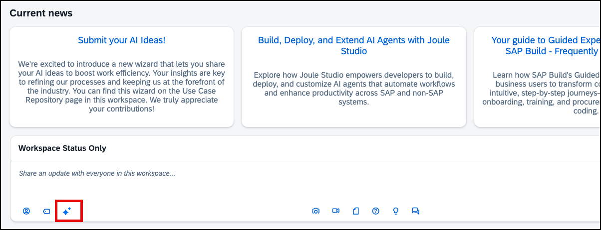</p>

3. Enter a prompt of your choice into the Ask AI field, e.g. "Write a status message that you are happy to be part of this AI community" or another prompt about SAP TechEd and click the **Send** icon.
   
<p align="center">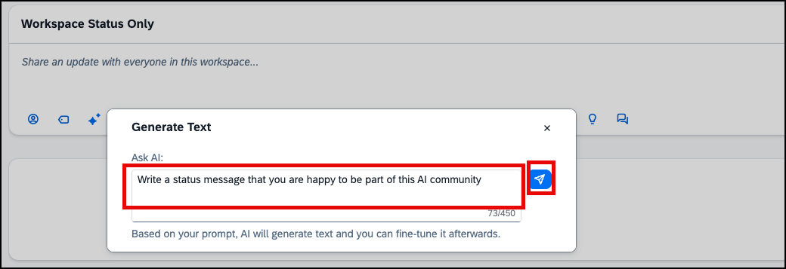</p>

4. Read the generated text and decide if that is what you would like to post (maybe after some adjustments). In this case, click **Accept**. Otherwise, you can either click **Retry** which will make AI generate a new text from the same prompt, or **Discard** which will remove the prompt, so you can start again from scratch.

<p align="center">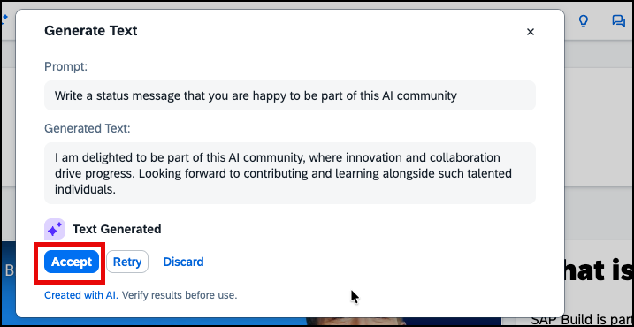</p>

5. Once you accept a text, it is added to the input field. You can now further edit it or simply click the **Share** button.

<p align="center">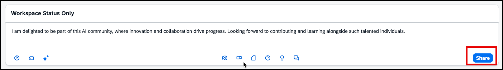</p>

6. You can also use text generation when commenting. Choose one of the entries in the feed and click the **Comment** button. Create and post a comment using text generation in the same way as the status update.

<p align="center">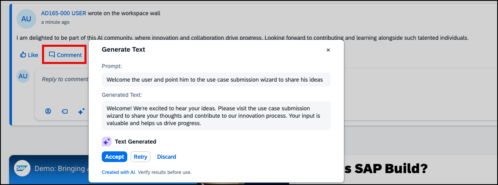</p>

---

## <a id="ai-summarization"></a> Exercise 4.2 Use text summarization to quickly grasp the content of a blog post

After completing these steps you will have created a summary of a blog post with the help of AI. To try this functionality, we created another workspace with some sample blog posts for you. You can simply find them via the search.

1. In the search window in the Work Zone shell enter the search term Joule and change the search scope to **Content**, so you do not only search in the current workspace, but in Work Zone content overall.
   
<p align="center">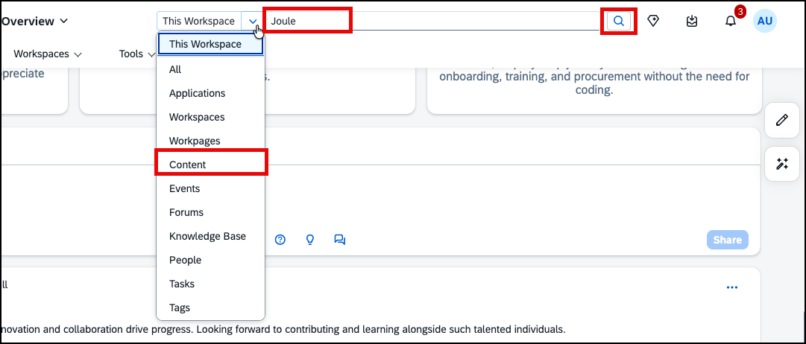</p>

2. Click on one of the blog posts in the search result, e.g. the **Build, Deploy, and Extend AI Agents with Joule Studio** blog post. The blog post is opened in the Public workspace where it is stored.

<p align="center">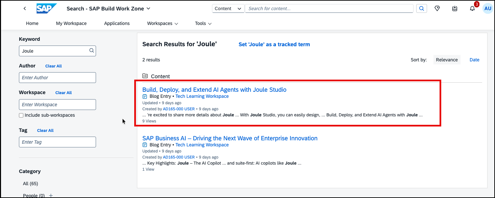</p>
  
3. Click the **Summarize** button to receive an AI generated summary of the blog post contents.

<p align="center">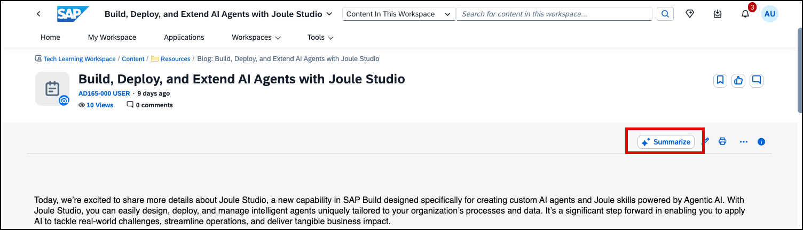</p>

4. Read the summary. It allows you to understand the main message of the text much faster.
   
<p align="center">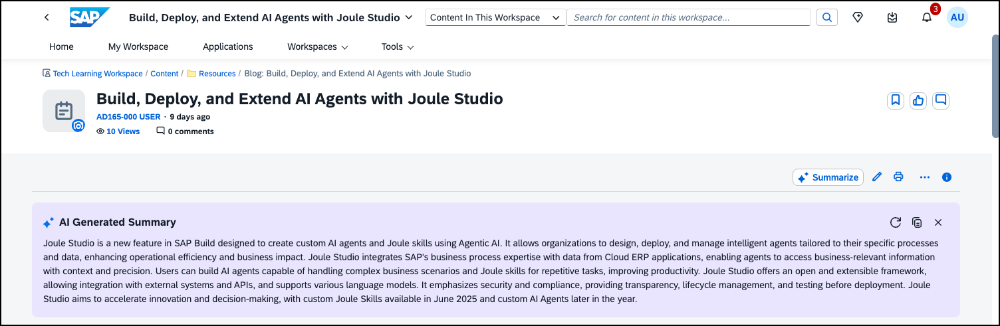</p>

---


## <a id="run-wizard"></a> Exercise 4.3 Use the Guided Experience to submit an AI Use Case

After completing these steps you will have submitted an AI Use case using the wizard you created in exercise 3.

1. Go to the **Use Case Repository** page of your workspace.

2. Scroll down to the **Idea Management Guided Process** and click **Create**.

<p align="center">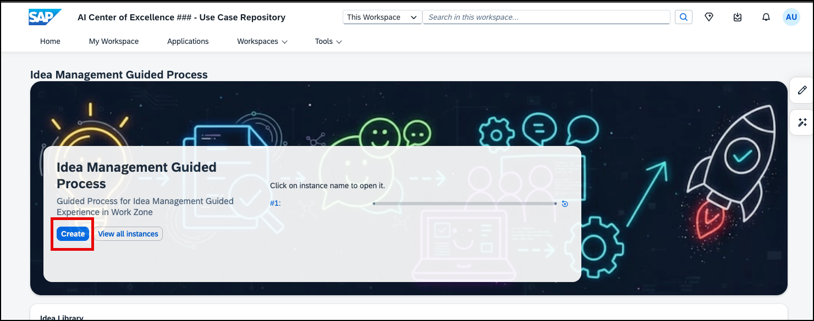</p>

3. In this step, AI should support you in formulating your use case idea describing a persona and a specific problem that your use case is going to solve. Feel free to add your own idea or use the examples given here.

First, give your instance of the Guided Experience a name containing your participant number, e.g. Stock prediction ###. Then enter a rough problem statement into the corresponding input field. For example:

````
Store managers cannot predict the dynamic demand and hence cannot manage their stocks optimally. This when solved should reduce over stocking or stock outages which will in turn increase business efficiency of the store.
````

> [!TIP]
> You can use other 'Problem Statements' from the examples below as well:
> ````
>Marketing Analysts need help to analyze large amounts of data they gather from various sources (e.g. sales data, market data, usage data). AI should collect data, identify patterns and predict how different measures will impact customer behavior
> ````
> ````
>Customer Experts in Service Teams cannot keep pace with inbound questions across channels making many missed opportunities and AI can help them keep tab on all fronts.
> ````
> ````
>Sales Agents who travel often find submitting expenses as slow and error-prone, wasting their valuable time; receipts get misread/miscategorized and bounce back for fixes.
> ````
> ````
>For every employee of the company, goal check-ins and 1:1s slip through the cracks, leaving employees without timely feedback or guidance. Performance review of employees suffer and often result in delayed feedback and drop in engagement.
> ````
> ````
>Support experts waste time hunting across wikis, chats, and PDFs for routine answers, slowing daily work.
> ````

<p align="center">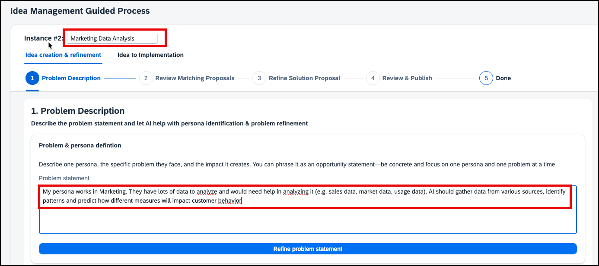</p>

4. Now click **Refine problem statement** to trigger the AI enhancement of the problem you entered. Check the result once it is available. You could now further adapt the refined statement or simply click **Next Step** to move on to the check for existing standard solutions for similar problems.

<p align="center">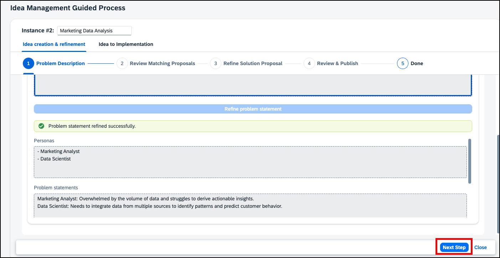</p>

5. In this step, the AI compares your problem statement with existing AI Agents provided by SAP Business AI and other idea proposals. The data for the existing agents is retrieved from the SAP Discovery Center. You will find a list of matching solutions and you can review them and decide if any of the proposed solutions would solve your current use case or that could be reused when implementing your solution or if the proposed solutions are not relevant. If one of the proposed solutions fully supported your use case, it would not be required to invest into developing a custom AI solution and you would decide at this point to stop the submission of this use case and turn the *Continue creating the new idea* switch to *Off*  at the bottom of the section.

If you find a solution that might be useful input for your use case, select **Reuse**. Keep the default **Not relevant** for all other (not matching) solution proposals and click **Next Step**.

<p align="center">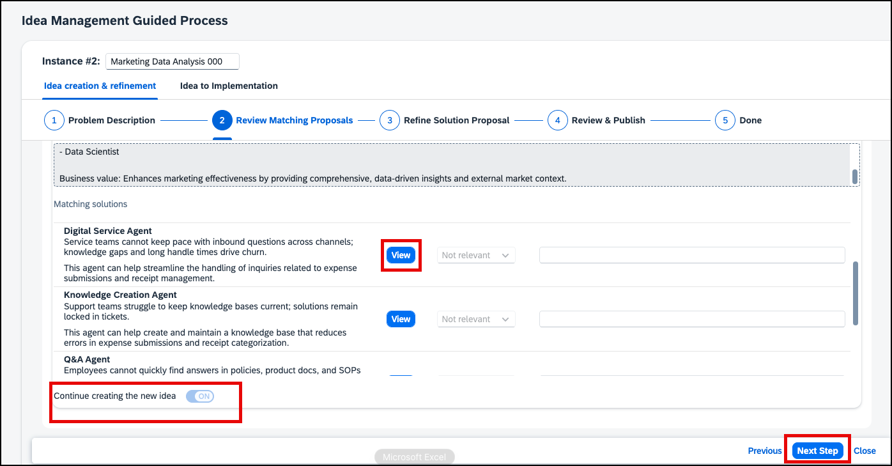</p>

6. The AI has further elaborated on your idea and proposed a solution summary. Feel free to click **Regenerate** if you do not like the proposal or to use the **Refine with my Input** button to add further aspects that should be reflected in the summary. Check the SAP tooling recommendations and adapt the business value and implementation cost entries if required. Then go on to the **Next Step**. 

<p align="center">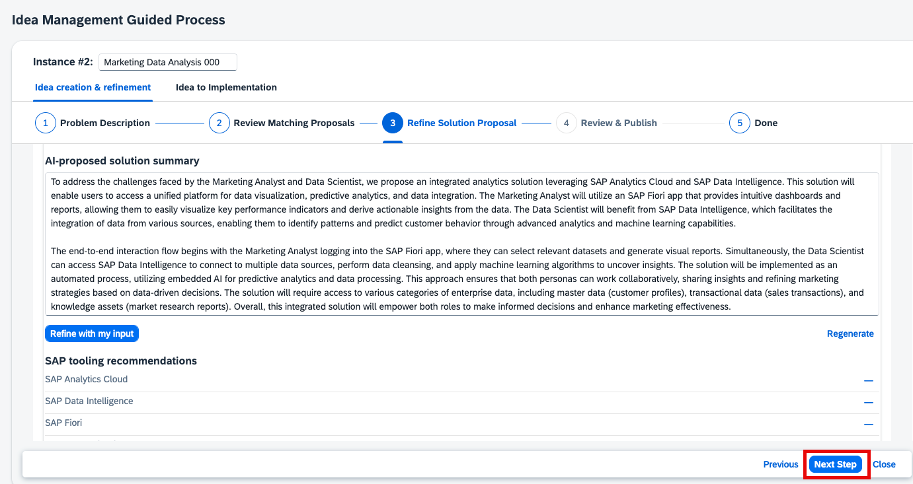</p>

7. Check the final summary that has been created and decide how you want to publish your idea, i.e. if you want to publish it for review and voting etc. Then click **Next Step**.

<p align="center">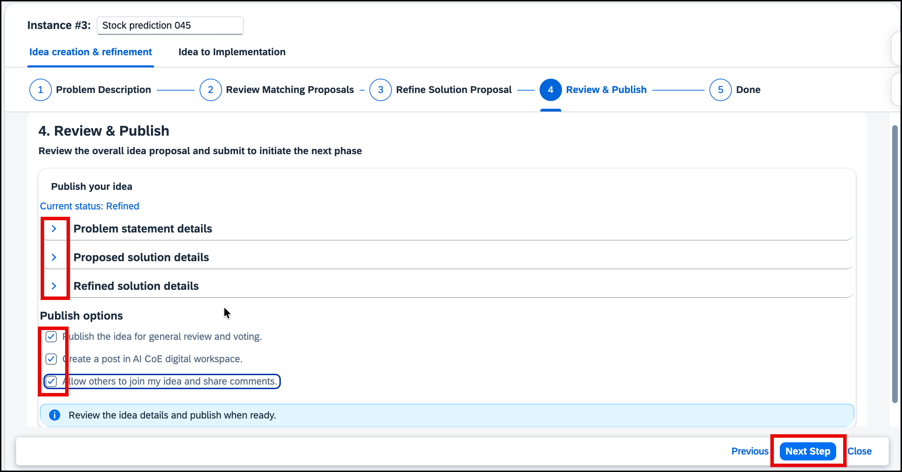</p>

8. Your idea is published and will become available in the **Idea Library** card below. You have now reached the end of the first stage. Click **Complete Stage** to finalize it.

<p align="center">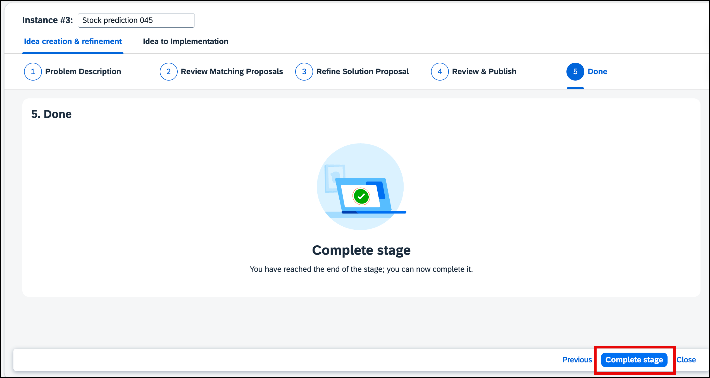</p>

9. Scroll down to the **Idea Library** card and click the **Refresh** button. You should now see your idea as part of the list. You can identify it best by the **Created by** column.

<p align="center">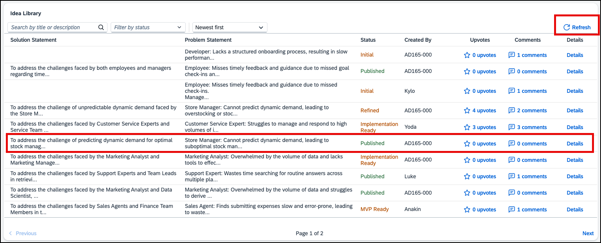</p>

10. Now, you could move on to the next stage **Idea to Implementation** and explore the steps of this stage as well. Depending on the time you have left, you can also go to the optional exercise 5 to learn about application integration and get to know the SAP Mobile Start app for mobile access to SAP Build Work Zone. 

---

## Summary

You've now tested some of the AI capabilities of SAP Build Work Zone: text generation, text summarization, and the usage of AI in custom UI integration cards. SAP Build Work Zone also supports document grounding with SAP Joule which allows you to add information gathered from corporate documents and information in workspaces as a resource for SAP Joule. This allows SAP Joule to provide more relevant and useful information to users and to refer to internal corporate information. 

> **Congratulations!** :clap: :clap:
> You have completed the main exercises of AD165 as part of SAP TechEd 2025.

If you still have some time left, we recommend that you continue to the optional [Exercise 5 - Learn about Business Content integration and access SAP Build Work Zone from a mobile device](../ex5/README.md).
