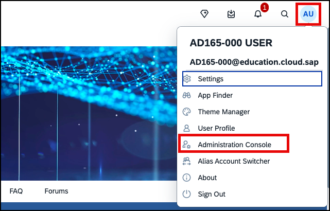
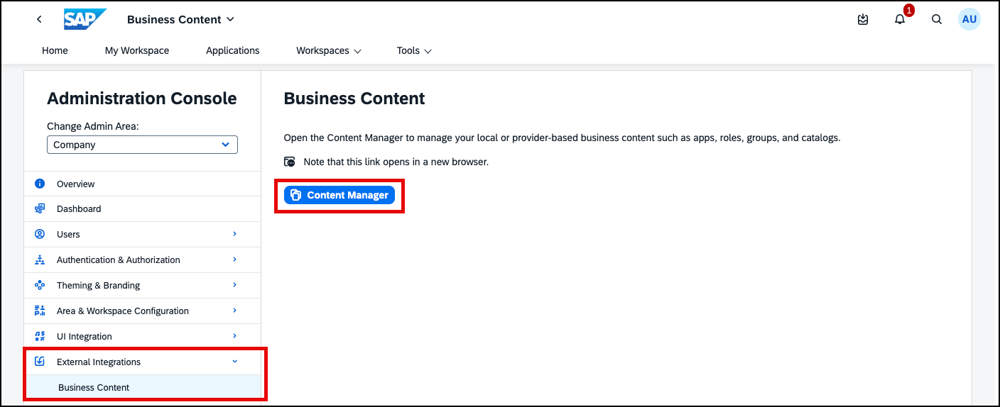
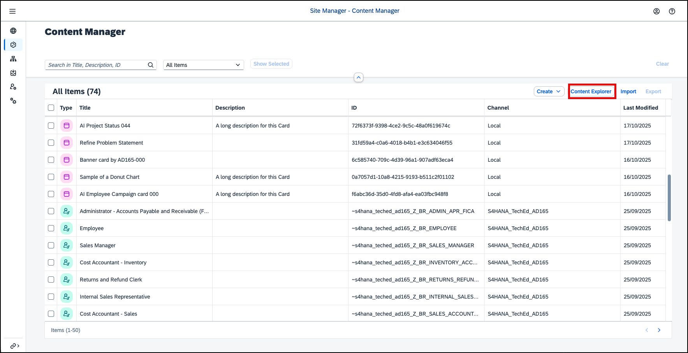
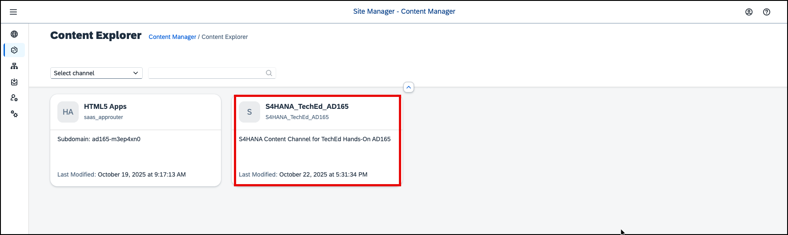
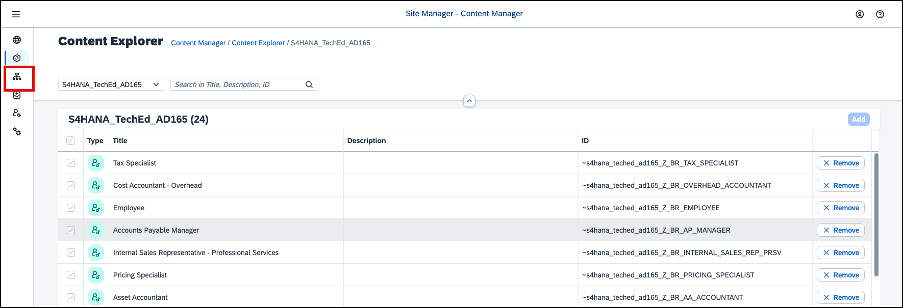
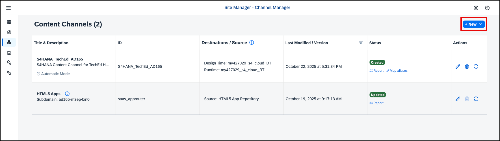
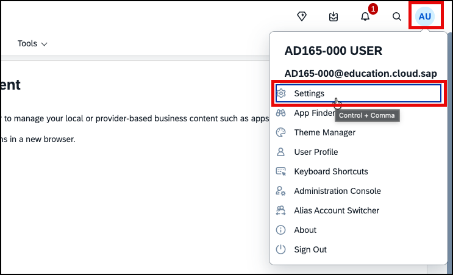
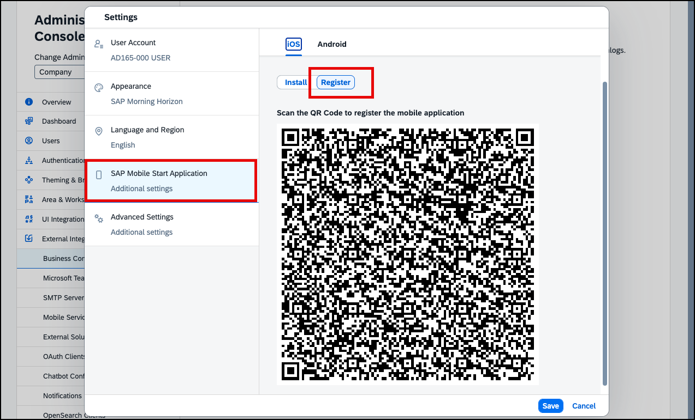

# Exercise 5 (optional) - Learn about Business Content integration and access SAP Build Work Zone from a mobile device

In this exercise, you will learn how business content from an SAP system can be integrated into SAP Build Work Zone. Finally, you will download the native SAP Mobile Start app to your own smartphone and open your SAP Build Work Zone site there.

> [!NOTE]
> Business content can be integrated in different ways, for example by creating UI integration cards that consume content from an OData service in an SAP system by making use of the connectivity services of SAP Business Technology Platform. Another option of integrating business content is called **`Content Federation`**. This federation scenario consists of a content exposure step where an administrator selects which content should be made available in SAP Build Work Zone (which is done on the content provider side, e.g. in an SAP S/4HANA system), and a content consumption step (done in SAP Build Work Zone). The exposure usually happens at role level and the exposure scope contains all content entities assigned to the selected roles, such as groups, catalogs, pages, and spaces.
>
> It is important to understand that the apps are not replicated or transported to SAP BTP, but the exposure provides meta data to allow SAP Build Work Zone to launch the applications that continue to run in the provider system.

## Exercise 5.1 Download SAP Mobile Start

Later in this exercise, we need the app *SAP Mobile Start* on our smartphone or tablet.
Since the download may take a moment depending on the network conditions, please start the download and installation of *SAP Mobile Start* to your smartphone or tablet already now.

1. Go to the app store of your smartphone depending on your device / platform. iOS devices can download SAP Mobile Start from the *Apple App Store*. Android devices can use *Google Play Store*.
    
    

> [!NOTE]
> If you already have SAP Mobile Start downloaded to your device and connected to your company's environment, you can still use it for this hands-on workshop.
> You can switch the environment SAP Mobile Start connects to from your user profile screen inside the app.

2. Start the download & installation of SAP Mobile Start while continuing with the next steps in this exercise.

   
## Exercise 5.2 Explore the administration environment for Business Content integration

After completing this exercise, you’ll be familiar with the administration of business content in SAP Build Work Zone. You already used this environment, when you were creating an app for your UI integration card in exercise 2. So let us go back there.

1. Click the user avatar in the upper right corner and select **Administration Console**.

2. In the menu on the left, select **External Integrations** > **Business Content**, then click the **Content Manager** button.

   
---

## What is the Content Manager?
The Content Manager is the tool you use to manage the business content items for your subaccount: apps, catalogs, groups, roles, spaces and pages, and shell plugins). It lets you:
- Create different content entities, e.g. apps, spaces, pages, roles.
- Open content entities for editing
- Search for content entities
- Import and export content entities

3. Click the **Create** button to see the list of content entities you could create here in the dropdown.
4. If you want, scroll down and click on any of the S/4HANA roles to open it and check out the apps and spaces assigned to it. Navigate back to the Content Manager using the breadcrumb.
5. Navigate to the Content Explorer by clicking the **Content Explorer** button.

   
---

## What is the Content Explorer?
The Content Explorer displays the available content providers and allows administrators to inspect the content items provided by them, such as apps and shell plugins, and add them to the content which is available for usage in the Content Manager.

In general, it is recommended to automatically add all content items to the subaccount, when you setup a new content
provider, but you might also decide that you prefer to pick and choose only specific roles to be available using the Content Explorer.

4. Click the **S4HANA_TechED_AD165** tile to open the Content Provider and see the exposed roles. Notice that 24 roles have been exposed from the SAP S/4HANA public cloud system. Also from here, you can navigate into the roles to check which apps and spaces belong to them.

   

5. Click the Channel Manager icon on the left to open the Channel Manager.

   
---

## What is the Channel Manager?
Administrators use the Channel Manager to define, edit, and get updates from remote content providers. When a new subaccount is configured, the *HTML5 Apps* content channel is available by default. It enables administrators to easily integrate apps deployed on SAP BTP to Work Zone. The Channel Manager lets you:
- Define new content channels based on SAP BTP destinations
- Configure settings for content channels
- Update a content channel manually. However, setting up automatic updates is usually the prefered solution.

   

1. Clicking the **New** button, you see that you can configure new content providers here, but also add an HTML5 Business Solution. This scenario enables providers of business solutions (SaaS) to share their business solution across subaccounts, by defining them as content providers. Both multi- and single-tenant business solutions are supported.

Please do not change the existing settings in this area.

---

## Exercise 5.3 Access SAP Build Work Zone on a mobile device

The exposed content can not only be accessed from a desktop browser but also using the native mobile app *SAP Mobile Start*.

1. Go back to the tab with *SAP Build Work Zone*, click on your user-initials on the top right of the Shell Bar.
2. Click on `Settings` to open the user settings.

3. Select the setting entry `SAP Mobile Start Application`.
4. Toggle the switch to `Register`. Depending on the screen resolution, you might need to scroll down to make the full QR Code visible.

6. Open the *SAP Mobile Start* app on your smartphone.
7. Click on `Scan QR Code` and scan your *Site's* QR.
    

> [!CAUTION]
> If you freshly installed *SAP Mobile Start* to your device, your operating system will prompt you whether you want to allow to receive push notifications. Make sure to select **Yes** in order to allow receiving push notification. Exercise 2.5 will make use of that. If you declined the alert before or just now by accident, you can later allow push notifications for *SAP Mobile Start* in your device's settings.

8. Sign in with the provided credentials.
9. By switching to the *Apps* tab on the bottom, you will be able to see *Site's* content structure equivalently to what you saw on the Applications tab in the desktop version.
   

Other Work Zone content, such as workspaces or workpages, available on SAP Mobile Start as web views. To achieve this, an administrator can create a URL application in the Content Manager using the URLs of the workspace or workpage. This was already pre-configured here for you so that you can now...

