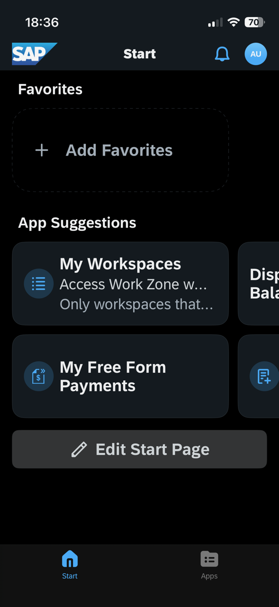
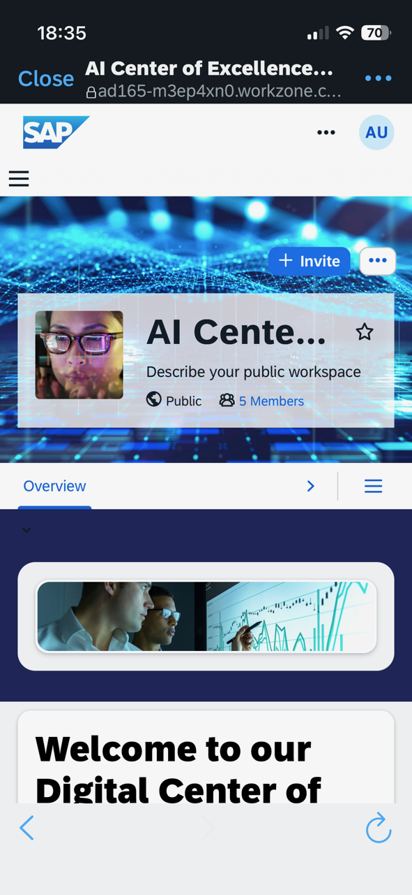
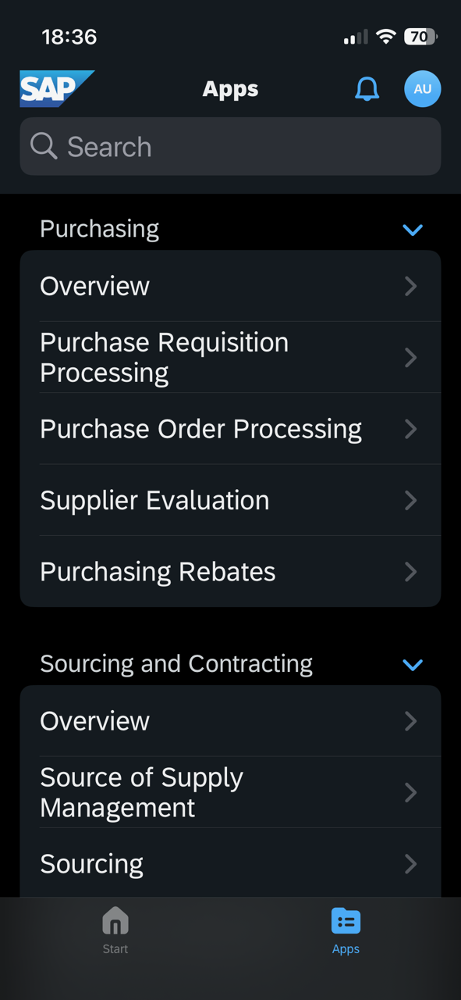

# Exercise 5 (optional) - Learn about Business Content integration and access SAP Build Work Zone from a mobile device

In this exercise, you will learn how business content from an SAP system can be integrated into SAP Build Work Zone. In addition, you will download the native SAP Mobile Start app to your own smartphone and open your SAP Build Work Zone site there.

> [!NOTE]
> Business content can be integrated in several ways within SAP Build Work Zone. One method is by creating UI integration cards that consume content from an OData service in an SAP system, utilizing the connectivity services of SAP Business Technology Platform (SAP BTP).
>
>Another integration method is called **Content Federation**. This scenario consists of two main steps:
>
>- **Content Exposure**: An administrator selects what content should be available in SAP Build Work Zone. This is typically done on the content provider side, for example, within an SAP S/4HANA system. The exposure usually happens at the role level and includes all content entities assigned to the selected roles, such as apps, groups, catalogs, pages, and spaces.
>
>- **Content Consumption**: This step occurs within SAP Build Work Zone, where a content channel is created and the exposed content is consumed.
>
>It’s important to note that the applications are not replicated or transported to SAP BTP. Instead, the exposure provides metadata that allows SAP Build Work Zone to launch the applications, which continue to run in the provider system.

##  Exercise 5.1 Download SAP Mobile Start

Later in this exercise, you will need the app *SAP Start* on our smartphone or tablet.
Since the download may take a moment depending on the network conditions, please start the download and installation of *SAP Mobile Start* to your smartphone or tablet already now.

1. Go to the app store of your smartphone depending on your device / platform. iOS devices can download SAP Mobile Start from the *Apple App Store*. Android devices can use *Google Play Store*.
    
    

> [!NOTE]
> If you already have SAP Mobile Start downloaded to your device and connected to your company's environment, you can still use it for this hands-on workshop.
> You can switch the environment SAP Mobile Start connects to from your user profile screen inside the app.

2. Start the download & installation of SAP Mobile Start while continuing with the next steps in this exercise.

##  Exercise 5.2 Explore the administration environment for Business Content integration

After completing this exercise, you’ll be familiar with the administration of business content in SAP Build Work Zone. You already used this environment in exercise 2, when you created an app for your UI integration card. So let us go back there.

1. Click your user avatar in the upper right corner and select **Administration Console**.

2. In the menu on the left, select **External Integrations** > **Business Content**, then click the **Content Manager** button.

   

---

### What is the Content Manager?
The Content Manager is the tool for managing all business content items for your subaccount: apps, catalogs, groups, roles, spaces and pages, and shell plugins. It lets you:
- Create different content entities, e.g. apps, spaces, pages, roles.
- Open content entities for editing
- Search for content entities
- Import and export content entities

To try it: 

3. Click the **Create** button to check out the types of content entities you could create here in the dropdown.

4. If you want, scroll down the content entities table and click on any of the S/4HANA roles to open it and view the apps and spaces assigned to it. Navigate back to the Content Manager using the breadcrumb.

5. Navigate to the Content Explorer by clicking the **Content Explorer** button.

   

---

### What is the Content Explorer?
The Content Explorer displays the available content providers and allows administrators to inspect the content items provided by them, such as apps and shell plugins, and add them to the content which is available for usage in the Content Manager.

In general, it is recommended to automatically add all content items from a content channel automatically to the Content Manager, when setting up a new content provider, but you might also decide that you prefer to pick and choose only specific roles to be available using the Content Explorer.  

6. Click the **S4HANA_TechED_AD165** tile to open the S/4HANA Content Provider and see the exposed roles. Notice that 24 roles have been exposed from the SAP S/4HANA public cloud system. Also from here, you can navigate into the roles to check which apps and spaces belong to them.

   

7. Click the Channel Manager icon on the left to open the Channel Manager.

   

---

### What is the Channel Manager?
Administrators use the Channel Manager to define, edit, and update content consumed from remote content providers. After the setup of Work Zone, the *HTML5 Apps* content channel is available by default out of the box. It enables administrators to easily integrate apps deployed on SAP BTP to Work Zone. The Channel Manager lets you:
- Define new content channels based on SAP BTP destinations
- Configure settings for content channels
- Update a content channel manually. However, setting up automatic updates is usually the prefered solution.

   

**Please do not change the existing settings in this area.**

1. Clicking the **New** button, you see that you can configure new content providers here, but also add an HTML5 Business Solution. This scenario enables providers of business solutions (SaaS) to share their business solution across subaccounts, by defining them as content providers. Both multi- and single-tenant business solutions are supported.

---

##  Exercise 5.3 Access SAP Build Work Zone on a mobile device

The exposed content can not only be accessed from a desktop browser but also using the native mobile app *SAP Mobile Start*.

1. Go back to the tab with *SAP Build Work Zone*, click on your user-initials on the top right of the Shell Bar.
2. Click on `Settings` to open the user settings.

3. Select the setting entry `SAP Mobile Start Application`.
4. Toggle the switch to `Register`. Depending on the screen resolution, you might need to scroll down to make the full QR Code visible.

5. Open the *SAP Mobile Start* app on your smartphone.
6. Click on `Scan QR Code` and scan your *Site's* QR.

> [!CAUTION]
> If you freshly installed *SAP Mobile Start* to your device, your operating system will prompt you whether you want to allow to receive push notifications. Make sure to select **Yes** in order to allow receiving push notification. Exercise 2.5 will make use of that. If you declined the alert before or just now by accident, you can later allow push notifications for *SAP Mobile Start* in your device's settings.

7. Sign in with the provided credentials.

On the bottom of the page, you see two tabs: Start and Apps. If SAP Task Center which is part of the SAP Build Work Zone license were configured, you would see a To-Dos tab with your open workflow tasks. 

> [!NOTE]
>- **Start**: You find your most relevant content on the Start screen and receive important information such as your latest to-dos (if SAP Task Center is configured) or company news. You can customize this page by adding favorites to the Favorites section on top of the page and by scrolling to the bottom and tapping Edit Start Page.
>- **Apps**: You find an exhaustive list of all your native and web-optimized apps on the Apps tab. The apps are displayed based on your assigned roles and the content corresponds to the apps that you see in the Apps area in the web experience of SAP Build Work Zone. Apps that do not support rendering on mobile devices are filtered.

You should now see a **My Workspaces** app in the app suggestions. Tab on it to see a  web view of all workspaces, use the search to find your workspace and navigate into it. 

  

8. By switching to the *Apps* tab on the bottom, you will be able to see *Site's* content structure with spaces and pages that were federated from the SAP S/4HANA system. You see the spaces as headlines (e.g. Purchasing, Sourcing and Contracting) and below the assigned pages of each space. Tab one of the pages to open it and see the assigned apps.
    
   

> [!IMPORTANT]
> **Wow!** :clap: :clap:
> You have now completed the final exercise of AD165 as part of SAP TechEd 2025.
> We hope that you got a good overview of how you can build great user experience with SAP Build Work Zone.  
> **Congratulations!** :clap: :clap:
